<div align="center">


# Admin Toolkit — Dataiku DSS

**A polished, multi-instance administration cockpit for Dataiku DSS: diagnostics, health scoring, cleanup tools, and cost insights in one webapp.**


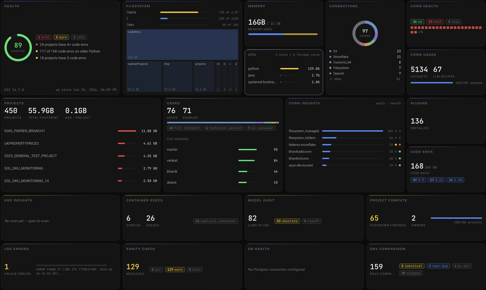

</div>

---

## What is it?

Admin Toolkit is a DSS plugin webapp that gives instance administrators a single pane of glass over everything that usually requires SSH sessions, ad-hoc notebooks, and tribal knowledge: disk and memory pressure, code-env sprawl, project footprint, connection health, Kubernetes spend, LLM connections, and more.

It connects to the running DSS instance through the Python API — all data is fetched live, no diagnostic bundles or file uploads needed. Configure additional DSS hosts as plugin presets and the same webapp scans **every instance in your fleet** from one top-bar switcher.

It scores what it finds, explains *why* something is unhealthy, and — behind an explicit unlock — gives you the tools to fix it: delete inactive projects, clean unused code envs, migrate filesystem data, prune stale Docker images, and email project owners about what they should fix themselves.

> **Admin-only tool.** Configure the webapp to require authentication and restrict it to admin groups. Do not expose it to regular users.

> **Beta, best-effort.** Not officially supported by Dataiku. Verify outputs before acting, and test against a sandbox before pointing it at production.

## Feature tour

The toolkit is organized into 9 sidebar sections covering 38 pages. Pages marked **tool** are advanced-action surfaces and are hidden behind the [Advanced Actions unlock](#advanced-actions-red-unlock).

### Overview

Instance vitals at a glance. **Mission Control** is the dense operations wall for watching the whole instance. **Summary** shows the composite health score, per-category breakdown, detected issues with expandable detail, and instance facts (DSS version, Python, cores, RAM, OS). **Filesystem** charts every mount point and drills into the DSS data directory with an interactive treemap and directory tree. **Resources** combines live memory, CPU, and process usage with configuration-based workload headroom analysis.

<div align="center">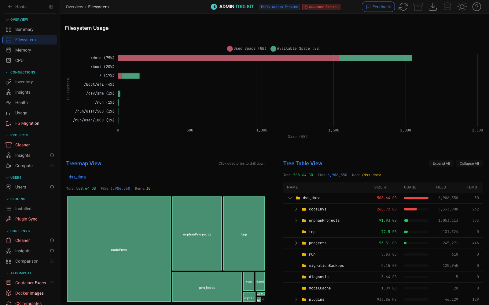</div>

<div align="center">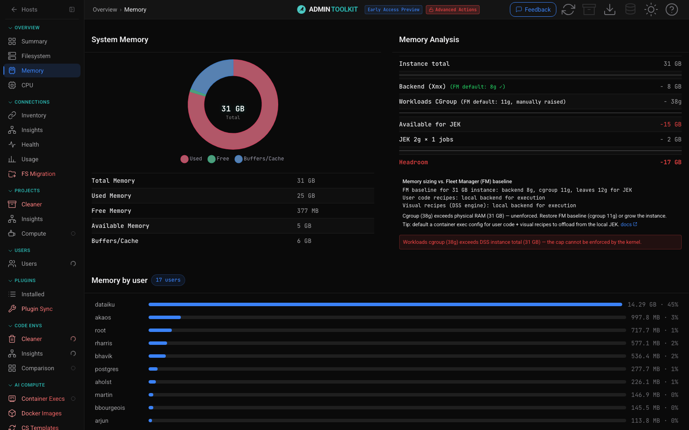</div>

### Agents

The **ATK Admin Agent** is one generalist across fleet health triage, scoping, investigation, and guarded administration. It combines read-only sensors with a plan → approve → execute protocol: every mutation is checked below the model by the master kill-switch, capability gates, an exact-target HMAC confirmation token, the backend's Advanced Actions gate, and executor policy. **Tuning** versions prompt/model overrides, **Permissions** controls read/write/execute and autonomous access per capability, and **How it works** explains the safety model in-product. Agent turns can use DSS ≥ 14.5 **Agent Interaction Logging** and a one-click Trace Explorer handoff. Conversations can optionally persist in built-in SQLite or Remote SQL, scoped per user and fleet host; all agent tools and the generalist ship inside this plugin.

### Connections

**Inventory** lists every connection with type and usage trends. **Insights** is the matrix view — datasets, recipes, LLM assets, filesystem usages, audit flags, and health per connection. **Health** runs live connection tests. **FS Migration** *(tool)* is an outreach-driven campaign to move data off local filesystem connections, with owner notification emails.

<div align="center">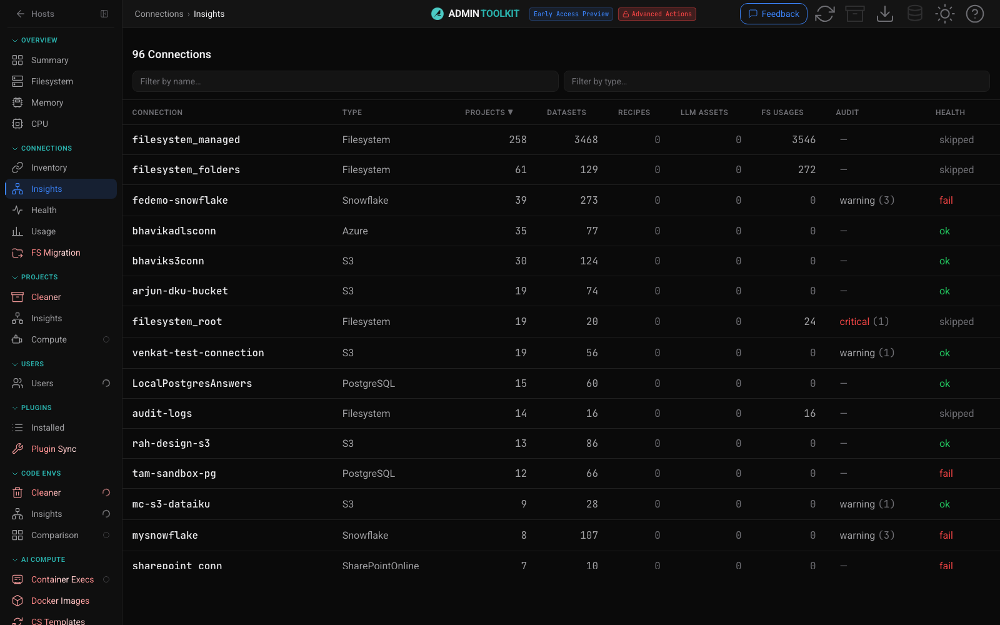</div>

### Projects

**Insights** computes the per-project footprint: size on disk, code envs, scenarios, flow complexity, permissions, and a health grade for every project. **App Instances** traces App-as-recipe sprawl, `keepInstance` causes, leftovers, and orphans. **Scenarios** projects schedules onto a shared timeline and surfaces failures, silence, overlap, broken/dormant chains, and invalid run-as users. **Compute** attributes compute usage to projects. **Cost** analyzes CRU and project spend signals. **Cleaner** *(tool)* finds projects inactive for a configurable number of days (no active scenarios, no deployed bundles), backs them up to a managed folder, and deletes them.

<div align="center">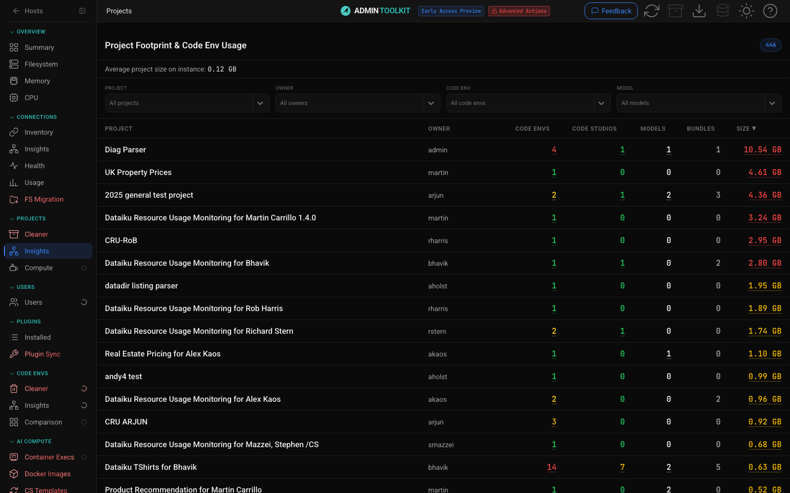</div>

<div align="center">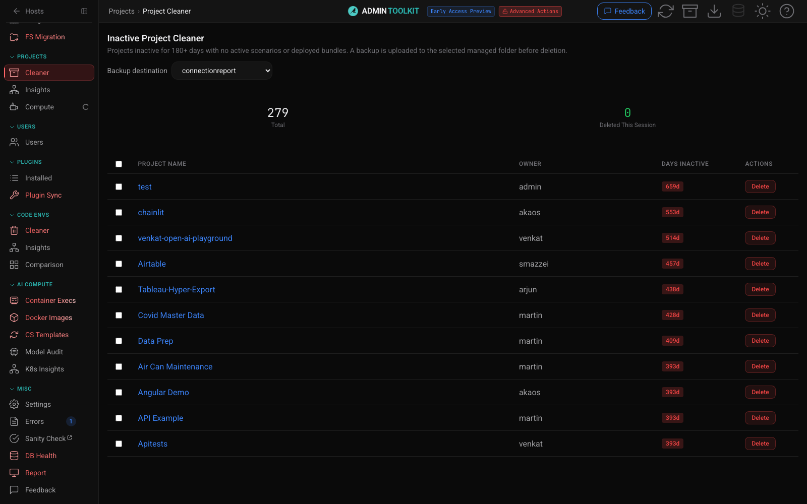</div>

### Users

Ownership and accountability: who owns which projects, code envs, and LLM assets, joined with login activity. **Activity** covers adoption, engagement, cohorts, retention, builders, and technology trends. **Churn** estimates dormant accounts, account lifecycle, seat reuse, and reclaim candidates — the set of pages to open before offboarding someone.

### Plugins

**Installed** lists every plugin with version and project usage. **Plugin Sync** *(tool)* compares plugin versions across your DSS hosts and pushes updates between them.

### Code Envs

The deepest module — code-env sprawl is usually the #1 health problem on a mature instance. **Insights** is the read-only view: every env with owner, Python version, size on disk, and exact usage (recipes, notebooks, scenarios, webapps, code studios). **Cleaner** *(tool)* deletes unused envs and migrates usages from one env to another. **Comparison** finds duplicate and near-duplicate envs worth merging. **Broken** scans failed builds, shows the relevant log excerpt, and can use an approved LLM to explain remediation.

<div align="center">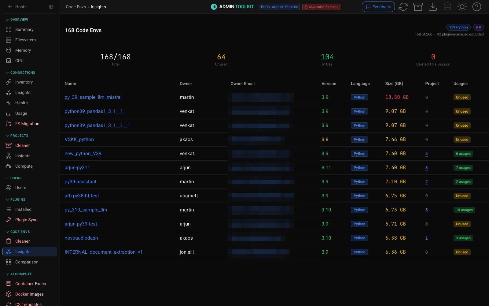</div>

### AI Compute

**Container Execs** *(tool)* streams the live container-execution inventory (K8s workloads per project, recipe, webapp). **Docker Images** *(tool)* prunes stale images from ECR/ACR/GAR registries. **CS Templates** *(tool)* migrates code studios between templates. **Model Audit** inventories every LLM connection and model with cost and replacement hints. **K8s Insights** audits your clusters live: node utilization, bin-packing savings, idle nodes, and rule-based findings with monthly cost estimates.

<div align="center">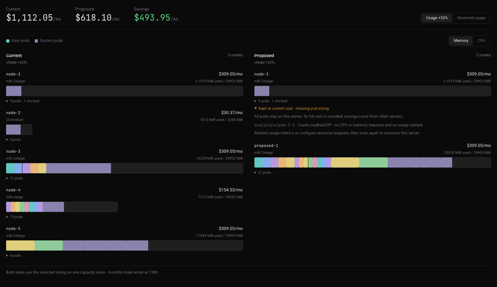</div>

<div align="center">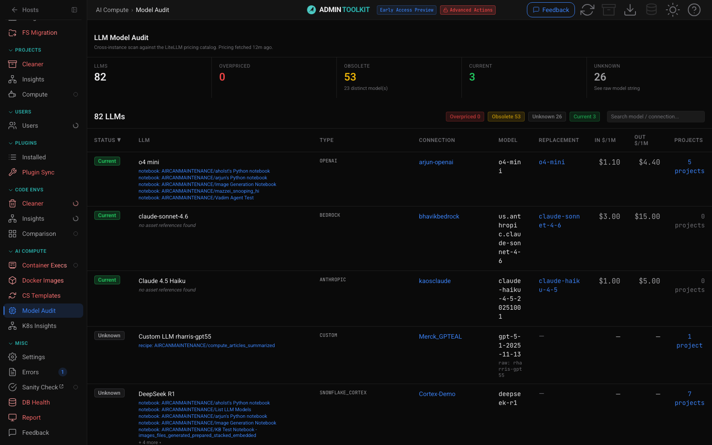</div>

### Misc

**Settings** (see [Configuration](#configuration)), **Errors** (parsed backend log errors with context), **Sanity Check** (API self-diagnostics), **DB Health** *(tool)* (PostgreSQL runtimedb bloat/vacuum analysis), **Report** *(tool)* (export findings as a standalone report), and **Feedback** (file bugs and ideas from inside the app).

### Full page index

| Section | Page | What it does |
|---|---|---|
| Overview | Mission Control | Dense operations wall for fleet-wide health |
| Agents | Agents | Chat with the generalist admin agent; investigate, plan → approve → execute |
| Agents | Tuning | Versioned prompt overrides + model override for the agents |
| Agents | Permissions | Per-action agent read/write/execute permissions and safety gates |
| Agents | How it works | Interactive tour of agent plans, approvals, tokens, permissions, audit and autonomy |
| Overview | Summary | Composite health score, issues, instance facts |
| Overview | Filesystem | Mount usage, data-dir treemap + directory tree |
| Overview | Resources | Live system/process memory and CPU, workload headroom |
| Connections | Inventory | All connections, types, trends |
| Connections | Insights | Usage/audit/health matrix per connection |
| Connections | Health | Live connection tests |
| Connections | FS Migration 🔴 | Migrate data off filesystem connections, with owner outreach |
| Projects | Cleaner 🔴 | Backup + delete inactive projects |
| Projects | Insights | Per-project footprint and health |
| Projects | App Instances | App-as-recipe sprawl: instances per template, `keepInstance` recipes, orphans |
| Projects | Scenarios | Scenario schedules on one timeline: trigger categories, load clustering, live next/last runs, failure/silence/overlap/chain/run-as signals |
| Projects | Compute | Compute usage by project |
| Projects | Cost | CRU and project spend analysis |
| Users | Users | Ownership, activity, accountability |
| Users | Activity | Adoption, engagement, retention, and activity trends |
| Users | Churn | Account lifecycle, dormant seats, reassignment estimates and reclaim candidates |
| Plugins | Installed | Plugin inventory with usage |
| Plugins | Plugin Sync 🔴 | Compare/push plugins across hosts |
| Code Envs | Cleaner 🔴 | Delete unused envs, migrate usages |
| Code Envs | Insights | Read-only env inventory with exact usages |
| Code Envs | Comparison | Find duplicate/mergeable envs |
| Code Envs | Broken | Failed-build inventory, log evidence and optional LLM remediation analysis |
| AI Compute | Container Execs 🔴 | Live K8s workload inventory (SSE stream) |
| AI Compute | Docker Images 🔴 | Prune stale images from ECR/ACR/GAR |
| AI Compute | CS Templates 🔴 | Replace code studio templates |
| AI Compute | Model Audit | LLM connection/model inventory with pricing |
| AI Compute | K8s Insights | Cluster cost + findings audit (SSE stream) |
| Misc | Settings | Thresholds, weights, mail, performance, support bundle |
| Misc | Errors | Parsed backend log errors |
| Misc | Sanity Check | API self-diagnostics |
| Misc | DB Health 🔴 | Runtimedb bloat/vacuum analysis |
| Misc | Report 🔴 | Exportable findings report |
| Misc | Feedback | In-app bug reports and ideas |

🔴 = advanced tool page, hidden until [Advanced Actions](#advanced-actions-red-unlock) are unlocked.

## Health Score

The composite 0–100 score is built from six weighted categories:

| Category | Default weight |
|---|---|
| Code Environments | 15% |
| Project Footprint | 15% |
| System Capacity | 30% |
| Security & Isolation | 0% |
| Version Currency | 10% |
| Runtime Config | 30% |

Categories aggregate individually toggleable health checks across Python and Spark versions, memory and filesystem capacity, open-files limits, isolation and cgroups, code-env and project pressure, disabled features, Java memory, runtime database, and other source-backed findings. A zero-weight category can still surface issues, and critical cap rules can clamp the overall score. **Every weight and threshold is tunable in Settings**, so the score reflects *your* definition of healthy.

## Architecture

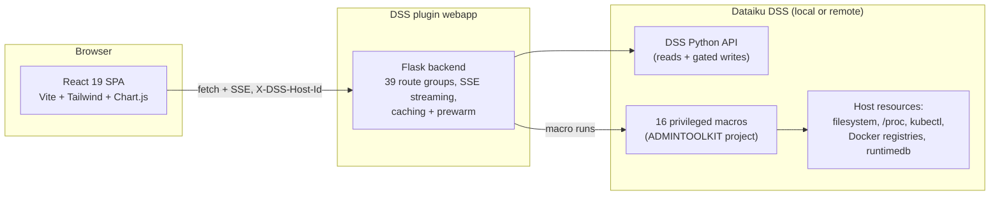

Pure DSS API operations talk to the instance directly. Anything host-bound (filesystem scans, process metrics, kubectl probes, registry calls, direct DB queries) runs as a **plugin macro** inside a dedicated `ADMINTOOLKIT` project — the toolkit offers to create it on first use with one click. Multi-instance support works by routing every request through an `X-DSS-Host-Id` header that selects the local instance or any configured remote preset.

## Installation

### Requirements

- A Dataiku DSS instance and **global admin** rights (to install the plugin and use the toolkit meaningfully).
- Python 3.10–3.13 available for the plugin code env. All Python dependencies (Flask, boto3, azure-identity, google-cloud-artifact-registry, psycopg2, …) are declared in the plugin's code-env spec and installed automatically when DSS builds it.
- For remote-host scanning, a **personal API key belonging to an admin user** on each remote DSS instance you want to scan — created from that user's **profile → API keys → New API key**. A global API key from **Settings → Security → Global API keys** will **not** work: it has no associated DSS user, so the remote rejects it with an error.
- Network access from the DSS instance to GitHub if you install from git. If that is not possible, install from a plugin ZIP instead.

### Install the plugin on your main DSS

This is the DSS where you will open the Admin Toolkit webapp. It can scan itself and, after setup, any remote DSS hosts you add.

1. Sign in to DSS as a global admin.
2. From the DSS application menu, open **Plugins**.
3. Select **Add plugin → Fetch from Git repository**.
4. In the repository URL field, paste:

   ```text
   https://github.com/gozu/admin-toolkit.git
   ```

5. Use branch `main`, unless you were given a different branch, tag, or commit.
6. Leave development mode off for normal installs.
7. Click **Fetch** / **Install**.
8. When DSS asks for the plugin code environment, choose **Build**. Wait until the build finishes successfully. The webapp backend runs in this code env.
9. Create the webapp in a locked-down admin project:
   - Open the DSS project where you want the webapp to live.
   - Go to **Webapps → New webapp → Plugin webapp**.
   - Choose **Admin Toolkit**.
   - Start the backend.
10. Restrict access before sharing the URL. Configure the webapp to require authentication and allow only admin groups.

If GitHub access fails, build a plugin ZIP from this repo and install with **Plugins → Add plugin → Upload plugin ZIP**. Git install is preferred when available because DSS can later use **Update from repository**.

### Set the master password

Advanced Actions are destructive or mutating workflows: delete, replace, migrate, deploy, send. They are hidden and server-blocked until an admin unlocks them.

Set this up once:

1. Open the plugin settings page for **Admin Toolkit**.
2. Type a strong password into **Master password** (store it in your password manager).
3. Save the plugin settings.
4. Open the Admin Toolkit webapp and click the red **Advanced Actions** badge in the header.
5. Enter the same password.

One password covers everything:

- It unlocks Advanced Actions in the webapp (remembered per browser in a cookie — use **Forget on this device** on shared machines).
- It encrypts remote-host API keys at rest (`adkfk1$…` blobs) and decrypts them automatically, with no separate unlock.
- It lets the headless agents (daily triage, actuator) unlock red endpoints on their own.
- Leave **Master password** empty if you want the toolkit to stay permanently read-only.

Upgrading from a pre-0.4.659 install to 0.4.660 or later? Nothing to do: the old `red_actions_password` / `host_keys_password` values are picked up automatically and migrated into **Master password** on first use, and installs that only ever set the hashed **Advanced Actions secret** keep working through the hash until you set the master password. (Upgrades that passed through 0.4.659 exactly lost the legacy values to DSS config pruning — re-enter the password once.)

### First launch and local host setup

Open the Admin Toolkit webapp. The first screen asks which host to scan.

- **Local DSS** means the DSS instance where this webapp is installed.
- If the local host needs host-level access, the app asks to create a support project named `ADMINTOOLKIT`.
- Click **Create and scan**. The project is used for plugin macros that read host resources such as filesystem, processes, Kubernetes, registry, or runtimedb data.

The `ADMINTOOLKIT` project is not where users work. It is a small support project used by the plugin so host-bound work runs under DSS control instead of arbitrary webapp shell access.

### Add remote DSS hosts from the webapp

Use this path for most installs. It is easier and safer than editing plugin presets manually.

Before adding a remote:

1. On the remote DSS, create a **personal API key that belongs to an admin user**: sign in as that admin and go to their **profile → API keys → New API key**. Do **not** use a global API key from **Settings → Security → Global API keys** — a global key has no associated DSS user, so it fails with an error, both for remote scanning and for installing the plugin from git.
2. Confirm the main DSS can reach the remote DSS URL over the network.
3. Know whether the remote uses a trusted TLS certificate. Keep TLS verification on unless this is a dev host with a self-signed certificate.

Then add the host:

1. In the Admin Toolkit webapp, unlock **Advanced Actions**.
2. Open **Settings → Remote Hosts**.
3. Click **Add host**.
4. Fill in:
   - **Label**: a human name such as `Production DSS` or `Automation Node`.
   - **URL**: the remote DSS base URL, for example `https://dss-prod.example.com`. Do not add a trailing slash.
   - **Admin API key**: the remote DSS admin user's **personal** API key (from their **profile → API keys → New API key**), not a global API key.
   - **Verify TLS certificate**: leave checked unless you knowingly use a self-signed dev certificate.
   - **Backup project key**: optional. Leave blank unless you want cleanup backups stored in a specific project.
5. Click **Add host**. If prompted for the master password, enter the Advanced Actions password.
6. Click **Test** on the saved row. A healthy remote should show that it is reachable, whether the plugin is installed, and whether the `ADMINTOOLKIT` project exists.

What is happening:

- The API key is sent over HTTPS to the local Admin Toolkit backend.
- The backend encrypts it before saving it into the local plugin settings.
- Encrypted keys are stored as `adkfk1$...` blobs.
- A fresh browser may ask you to unlock before it can use encrypted remote keys.
- The plaintext API key is never shown again. To rotate it, edit the host and paste the new key.

### Install the toolkit on remote hosts from the webapp

Remote hosts can be listed before the plugin is installed there, but full scanning needs the plugin on each remote. Host-bound macros run on the selected host, so a remote must have the plugin and the `ADMINTOOLKIT` support project.

The webapp can bootstrap a remote for you:

1. Go back to the host picker or use the top-bar host switcher.
2. Click the remote host.
3. If the host is reachable but the plugin is missing, the app opens **Install Admin Toolkit on this host**.
4. Choose an install source:
   - **From git**: recommended. The remote DSS pulls from `https://github.com/gozu/admin-toolkit.git`, branch `main`. Use this when the remote can reach GitHub.
   - **Upload .zip**: fallback for private, air-gapped, or GitHub-blocked environments. Upload a built plugin ZIP from this repo.
5. Click **Install** and wait. The dialog streams progress for:
   - **Install plugin**: installs or updates the plugin on the remote DSS.
   - **Build code env**: builds and selects the plugin managed code env on the remote.
   - **Create project**: creates the `ADMINTOOLKIT` support project if it does not already exist.
6. When the flow finishes, click **Enter host**.

If the git install fails, the dialog switches to the ZIP-upload fallback. This commonly means the remote cannot reach GitHub, the repository is private from that host, or the API key cannot resolve git credentials. Use the ZIP path in those cases.

### Manual remote setup fallback

If the webapp installer cannot be used, repeat the main install steps directly on the remote DSS:

1. Install the plugin on the remote DSS from git or ZIP.
2. Build the plugin code environment on the remote DSS.
3. Return to the main Admin Toolkit webapp.
4. Add or test the remote host from **Settings → Remote Hosts**.
5. When prompted, let the app create the remote `ADMINTOOLKIT` support project.

Avoid manually creating `remote-dss-host` plugin presets unless you know exactly what you are doing. The webapp encrypts remote API keys automatically; the raw preset field expects an `adkfk1$...` encrypted blob, not a normal plaintext password field.

### Common setup mistakes

| Symptom | Most likely fix |
|---|---|
| Git install fails on the main DSS | Use the HTTPS URL exactly: `https://github.com/gozu/admin-toolkit.git`, or install from ZIP. |
| Webapp starts but pages fail | Rebuild the plugin code env and restart the webapp backend. |
| Advanced Actions button says no password is configured | Set **Master password** in the plugin settings, save, then unlock again. |
| Remote host says keys are locked | The key was encrypted under a different password — re-save the host in Settings → Remote Hosts, or set the matching **Master password**. |
| Remote host is reachable but plugin is missing | Use the webapp install dialog, or manually install the plugin on that remote. |
| Remote host says support project missing | Click **Create and scan** so the app creates `ADMINTOOLKIT` on that host. |
| Remote git install fails with credential/user errors | Use a personal admin API key for the remote host, or switch to **Upload .zip**. |
| Remote TLS errors | Fix the certificate if this is production. Only uncheck TLS verification for dev hosts you trust. |

## Configuration

Everything lives on the **Settings** page (plus the plugin preset for secrets):

- **Thresholds & scoring** — inactive-project days, code-env sprawl limits, Python/Spark minimums, capacity floors, and the six health-score weights. Defaults are sensible; tune them to your fleet.
- **Mail channel** — pick the DSS messaging channel used by outreach campaigns.
- **DB Health connection** — point the DB Health tool at your PostgreSQL runtimedb (read-only analysis).
- **Save tables as datasets** — optionally pick a connection so any UI table can be exported as a managed dataset in the webapp's project.
- **Agents chat persistence** — in the plugin settings, `chat_storage` turns on server-side conversation history for the Agents page: Off (browser-only, the default), Built-in SQLite, or a Remote SQL connection (PostgreSQL / SQL Server, with a configurable table prefix). Conversations are stored per user and per fleet host; storage changes apply on the next webapp backend restart.
- **Performance tuning** — worker counts and cache windows, with a one-click **benchmark auto-tuner** that sweeps worker configurations against your real workload and applies the best one.
- **Support bundle** — download a ZIP of backend logs, settings, and performance diagnostics for troubleshooting.

<div align="center">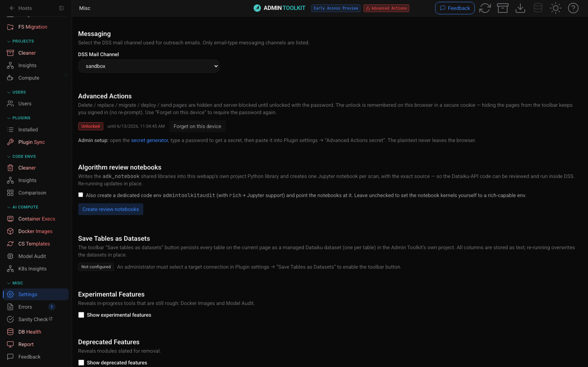</div>

## Auditability

Every number the toolkit shows should be checkable, not taken on faith. The entire plugin is open-source. Convert it to a dev plugin in Dataiku for full access to its files. Both python backend and React frontend.

In addition, Under Settings, you can create python notebooks with the same algorithms being used to collect data for even easier inspection / modification testing.

## Project structure

```
plugin.json                  # plugin manifest (params, version, secrets)
webapps/admin-toolkit/       # Flask webapp entrypoint
python-lib/                  # backend: adk_backend/ (39 route groups) + shared libs
python-runnables/            # 16 host-bound macros (host/resource/process metrics, adoption, K8s, images, DB, CS, CRU, triage, and cleanup/governance actions)
python-lib/atk_agent_common/ # agents layer shared lib (tools impl, actuator, triage, audit)
python-agents/               # 1 generalist plugin agent (ATK Admin Agent)
python-agent-tools/          # 13 agent tools over the toolkit's sensor and guarded-action APIs
code-env/python/spec/        # plugin code env dependency spec
resource/frontend/           # React SPA (src/, public/, tests/)
scripts/                     # deploy + contract-check tooling (scripts/agents/ = agent test harness)
docs/                        # UI/UX contracts, screenshots, agents developer reference
Makefile                     # build & deploy orchestration
```

Every module plugs into shared navigation, lifecycle, and availability contracts instead of hand-wiring pages. The full rules live in [`docs/ui-ux-contracts.md`](docs/ui-ux-contracts.md); release history is in [`CHANGELOG.md`](CHANGELOG.md).

## Security model

- **Admin-only by design** — install the webapp behind DSS authentication, restricted to admin groups.
- **Read-only by default** — without the master password, no mutating endpoint is reachable; mutation routes are additionally gated server-side, not just hidden in the UI.
- **Explicit unlock for writes** — delete / replace / migrate / deploy / send require the per-session red unlock backed by the plugin-level master password.
- **Scoped host access** — host-bound operations run as DSS macros inside the dedicated `ADMINTOOLKIT` project under the DSS service account, never as arbitrary shell from the webapp.
- **Backups before destruction** — the Project Cleaner uploads a project backup to a managed folder before any delete.

---

<div align="center">

Built by **Alex Kaos** · © 2026 — All rights reserved. Not an official Dataiku product.

</div>
