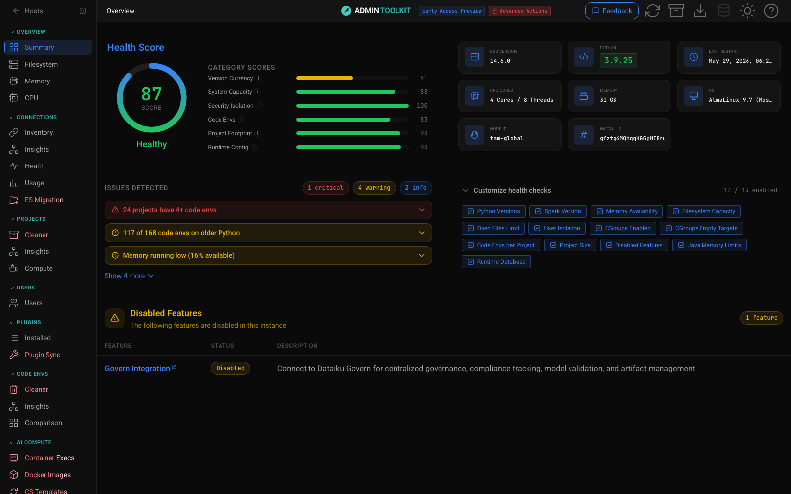

<div align="center">


# Admin Toolkit — Dataiku DSS

**A polished, multi-instance administration cockpit for Dataiku DSS: diagnostics, health scoring, cleanup tools, and cost insights in one webapp.**




</div>

---

## What is it?

Admin Toolkit is a DSS plugin webapp that gives instance administrators a single pane of glass over everything that usually requires SSH sessions, ad-hoc notebooks, and tribal knowledge: disk and memory pressure, code-env sprawl, project footprint, connection health, Kubernetes spend, LLM connections, and more.

It connects to the running DSS instance through the Python API — all data is fetched live, no diagnostic bundles or file uploads needed. Configure additional DSS hosts as plugin presets and the same webapp scans **every instance in your fleet** from one top-bar switcher.

It scores what it finds, explains *why* something is unhealthy, and — behind an explicit unlock — gives you the tools to fix it: delete inactive projects, clean unused code envs, migrate filesystem data, prune stale Docker images, and email project owners about what they should fix themselves.

> **Admin-only tool.** Configure the webapp to require authentication and restrict it to admin groups. Do not expose it to regular users.

> **Beta, best-effort.** Not officially supported by Dataiku. Verify outputs before acting, and test against a sandbox before pointing it at production.

## Feature tour

The toolkit is organized into 8 sidebar sections covering 29 pages. Pages marked **tool** perform mutations and are hidden behind the [Advanced Actions unlock](#advanced-actions-red-unlock).

### Overview

Instance vitals at a glance. **Summary** is the landing page: composite health score, per-category breakdown, detected issues with expandable detail, and instance facts (DSS version, Python, cores, RAM, OS). **Filesystem** charts every mount point and drills into the DSS data directory with an interactive treemap and directory tree. **Memory** and **CPU** show live process-level usage by user and component, with workload headroom analysis.

<div align="center"></div>

<div align="center"></div>

### Connections

**Inventory** lists every connection with type and usage trends. **Insights** is the matrix view — datasets, recipes, LLM assets, filesystem usages, audit flags, and health per connection. **Health** runs live connection tests; **Usage** maps which projects consume which connections. **FS Migration** *(tool)* is an outreach-driven campaign to move data off local filesystem connections, with owner notification emails.

<div align="center"></div>

### Projects

**Insights** computes the per-project footprint: size on disk, code envs, scenarios, flow complexity, permissions, and a health grade for every project. **Compute** attributes compute usage to projects. **Cleaner** *(tool)* finds projects inactive for a configurable number of days (no active scenarios, no deployed bundles), backs them up to a managed folder, and deletes them.

<div align="center"></div>

<div align="center"></div>

### Users

Ownership and accountability: who owns which projects, code envs, and LLM assets, joined with login activity — the page to open before offboarding someone.

### Plugins

**Installed** lists every plugin with version and project usage. **Plugin Sync** *(tool)* compares plugin versions across your DSS hosts and pushes updates between them.

### Code Envs

The deepest module — code-env sprawl is usually the #1 health problem on a mature instance. **Insights** is the read-only view: every env with owner, Python version, size on disk, and exact usage (recipes, notebooks, scenarios, webapps, code studios). **Cleaner** *(tool)* deletes unused envs and migrates usages from one env to another. **Comparison** finds duplicate and near-duplicate envs worth merging.

<div align="center"></div>

### AI Compute

**Container Execs** *(tool)* streams the live container-execution inventory (K8s workloads per project, recipe, webapp). **Docker Images** *(tool)* prunes stale images from ECR/ACR/GAR registries. **CS Templates** *(tool)* migrates code studios between templates. **Model Audit** inventories every LLM connection and model with cost and replacement hints. **K8s Insights** audits your clusters live: node utilization, bin-packing savings, idle nodes, and rule-based findings with monthly cost estimates.

<div align="center"></div>

<div align="center"></div>

### Misc

**Settings** (see [Configuration](#configuration)), **Errors** (parsed backend log errors with context), **Sanity Check** (API self-diagnostics), **DB Health** *(tool)* (PostgreSQL runtimedb bloat/vacuum analysis), **Report** *(tool)* (export findings as a standalone report), and **Feedback** (file bugs and ideas from inside the app).

### Full page index

| Section | Page | What it does |
|---|---|---|
| Overview | Summary | Composite health score, issues, instance facts |
| Overview | Filesystem | Mount usage, data-dir treemap + directory tree |
| Overview | Memory | System/process RAM, workload headroom |
| Overview | CPU | Process-level CPU usage |
| Connections | Inventory | All connections, types, trends |
| Connections | Insights | Usage/audit/health matrix per connection |
| Connections | Health | Live connection tests |
| Connections | Usage | Project ↔ connection consumption map |
| Connections | FS Migration 🔴 | Migrate data off filesystem connections, with owner outreach |
| Projects | Cleaner 🔴 | Backup + delete inactive projects |
| Projects | Insights | Per-project footprint and health |
| Projects | Compute | Compute usage by project |
| Users | Users | Ownership, activity, accountability |
| Plugins | Installed | Plugin inventory with usage |
| Plugins | Plugin Sync 🔴 | Compare/push plugins across hosts |
| Code Envs | Cleaner 🔴 | Delete unused envs, migrate usages |
| Code Envs | Insights | Read-only env inventory with exact usages |
| Code Envs | Comparison | Find duplicate/mergeable envs |
| AI Compute | Container Execs 🔴 | Live K8s workload inventory (SSE stream) |
| AI Compute | Docker Images 🔴 | Prune stale images from ECR/ACR/GAR |
| AI Compute | CS Templates 🔴 | Replace code studio templates |
| AI Compute | Model Audit | LLM connection/model inventory with pricing |
| AI Compute | K8s Insights | Cluster cost + findings audit (SSE stream) |
| Misc | Settings | Thresholds, weights, mail, performance, support bundle |
| Misc | Errors | Parsed backend log errors |
| Misc | Sanity Check | API self-diagnostics |
| Misc | DB Health 🔴 | Runtimedb bloat/vacuum analysis |
| Misc | Report 🔴 | Exportable findings report |
| Misc | Feedback | In-app bug reports and ideas |

🔴 = advanced tool page, hidden until [Advanced Actions](#advanced-actions-red-unlock) are unlocked.

## Health Score

The composite 0–100 score is built from six weighted categories:

| Category | Default weight |
|---|---|
| Code Environments | 35% |
| Project Footprint | 30% |
| System Capacity | 15% |
| Security & Isolation | 10% |
| Version Currency | 5% |
| Runtime Config | 5% |

Categories aggregate 13 individually toggleable health checks — Python versions, Spark version, memory availability, filesystem capacity, open-files limit, user isolation, cgroups (enabled + empty targets), code envs per project, project size pressure, disabled features, Java memory limits, and runtime database. **Every weight and threshold is tunable in Settings**, so the score reflects *your* definition of healthy.

## Architecture


Pure DSS API operations talk to the instance directly. Anything host-bound (filesystem scans, process metrics, kubectl probes, registry calls, direct DB queries) runs as a **plugin macro** inside a dedicated `ADMINTOOLKIT` project — the toolkit offers to create it on first use with one click. Multi-instance support works by routing every request through an `X-DSS-Host-Id` header that selects the local instance or any configured remote preset.

## Installation

### Requirements

- A Dataiku DSS instance and **global admin** rights (to install the plugin and use the toolkit meaningfully).
- Python 3.9+ available for the plugin code env. All Python dependencies (Flask, boto3, azure-identity, google-cloud-artifact-registry, psycopg2, …) are declared in the plugin's code-env spec and installed automatically when DSS builds it.

### Install the plugin

1. Ensure you are able to pull from DSS to this repo — send your SSH public key to the author to be granted read access if necessary.
2. In DSS: **Plugins → Add plugin → Fetch from Git repository** → `git@github.com:gozu/admin-toolkit.git`. Future upgrades are then one click: **Update from repository**.
3. When prompted, **build the plugin code environment** (the webapp backend runs in it).
4. In a project of your choice: **Webapps → New webapp → Plugin webapp → Admin Toolkit**, then start the backend.
5. **Restrict access**: configure the webapp to require authentication and limit it to admin groups.
6. On first launch, pick a host on the landing screen. The first time a module needs host-level access, the toolkit offers to create the `ADMINTOOLKIT` macro project — one-click confirm.

### Multi-instance setup

1. In the plugin settings, define instances of the **Remote DSS Hosts** preset (URL + admin API key per remote).
2. Each remote you want to *fully* scan also needs the plugin installed (macros run on the target host).
3. Switch hosts from the top-bar dropdown — every page rescans against the selected instance, and the toolkit bootstraps `ADMINTOOLKIT` on each remote the first time it's needed.

### Advanced Actions (red unlock)

Mutating tools — delete, replace, migrate, deploy, send — are locked by default and their pages are hidden from the sidebar. To enable them:

1. Generate a secret with the linked generator in the plugin settings (type a password, copy the hash).
2. Paste it into the **Advanced Actions secret** plugin setting.
3. In the webapp, click the **Advanced Actions** badge in the header and enter the password to unlock for your session.

Leave the setting empty to keep the toolkit permanently read-only.

## Configuration

Everything lives on the **Settings** page (plus the plugin preset for secrets):

- **Thresholds & scoring** — inactive-project days, code-env sprawl limits, Python/Spark minimums, capacity floors, and the six health-score weights. Defaults are sensible; tune them to your fleet.
- **Mail channel** — pick the DSS messaging channel used by outreach campaigns.
- **DB Health connection** — point the DB Health tool at your PostgreSQL runtimedb (read-only analysis).
- **Save tables as datasets** — optionally pick a connection so any UI table can be exported as a managed dataset in the webapp's project.
- **Performance tuning** — worker counts and cache windows, with a one-click **benchmark auto-tuner** that sweeps worker configurations against your real workload and applies the best one.
- **Support bundle** — download a ZIP of backend logs, settings, and performance diagnostics for troubleshooting.

<div align="center"></div>

## Auditability

Every number the toolkit shows should be checkable, not taken on faith. The entire plugin is open-source. Convert it to a dev plugin in Dataiku for full access to its files. Both python backend and React frontend.

In addition, Under Settings, you can create python notebooks with the same algorithms being used to collect data for even easier inspection / modification testing.

## Project structure

```
plugin.json                  # plugin manifest (params, version, secrets)
webapps/admin-toolkit/       # Flask webapp entrypoint
python-lib/                  # backend: adk_backend/ (24 route groups) + shared libs
python-runnables/            # 6 host-bound macros (metrics, k8s, images, db, cs, dbhealth)
code-env/python/spec/        # plugin code env dependency spec
resource/frontend/           # React SPA (src/, public/, tests/)
scripts/                     # deploy + contract-check tooling
docs/                        # UI/UX contracts, screenshots
Makefile                     # build & deploy orchestration
```

Every module plugs into shared navigation, lifecycle, and availability contracts instead of hand-wiring pages. The full rules live in [`docs/ui-ux-contracts.md`](docs/ui-ux-contracts.md); release history is in [`CHANGELOG.md`](CHANGELOG.md).

## Security model

- **Admin-only by design** — install the webapp behind DSS authentication, restricted to admin groups.
- **Read-only by default** — without the Advanced Actions secret, no mutating endpoint is reachable; mutation routes are additionally gated server-side, not just hidden in the UI.
- **Explicit unlock for writes** — delete / replace / migrate / deploy / send require the per-session red unlock backed by the plugin-level secret.
- **Scoped host access** — host-bound operations run as DSS macros inside the dedicated `ADMINTOOLKIT` project under the DSS service account, never as arbitrary shell from the webapp.
- **Backups before destruction** — the Project Cleaner uploads a project backup to a managed folder before any delete.

---

<div align="center">

Built by **Alex Kaos** · © 2026 — All rights reserved. Not an official Dataiku product.

</div>
