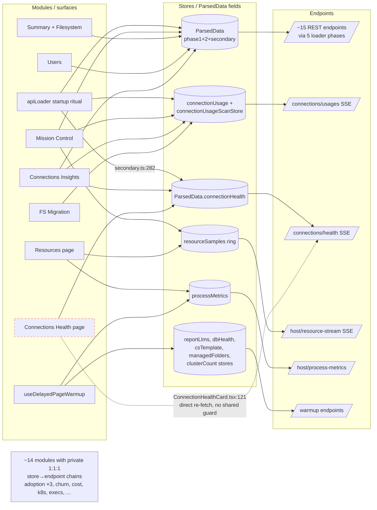

# Level 3 — Module Graph

**Question this level answers:** Which modules independently fetch data another
module already has? Is one scan feeding many surfaces?

| | |
|---|---|
| Date | 2026-07-23 |
| Git HEAD | `f09db6a` |
| akaos toolkit version | 0.4.792 (`/api/mode`) |

Citations are `path:line (symbol)` relative to the repo root (frontend paths
under `resource/frontend/src/`). **Re-grep the symbol before trusting a line
number after any release** — lines drift, symbol names rarely do. Provenance:
everything in this doc is `[code]` (source-derived).

## 1. The HTTP chokepoint

Every frontend request funnels through `utils/api.ts` — direct `fetch(` calls
outside it are banned by `scripts/check_frontend_contracts.mjs`.

| Function | Purpose |
|---|---|
| `fetchRaw` (`utils/api.ts:121`) | Raw `Response` — used by all SSE consumers |
| `fetchJson` (`utils/api.ts:144`) | JSON + typed error handling |
| `fetchText` (`utils/api.ts:153`) | Plain text (e.g. `/api/java-memory`) |
| `fetchSse` (`utils/api.ts:162`) | Response → `parseSseStream` generator |

All four inject `X-DSS-Host-Id` via `withHostHeader` (`utils/api.ts:100`) —
this is the multi-instance routing header the backend's `_attach_client` hook
reads. **There is no caching and no request dedup at this layer.** Dedup is
per-store: `createModuleScanStore` holds an `inflight` promise
(`state/createModuleScanStore.ts:141` (`load`)) and returns it to concurrent
callers; sync stores implement (or omit) their own guards — see §3.

## 2. Module inventory

35 modules in `MODULES` (`utils/moduleRegistry.ts:61`). Availability policies
other than `always` (5 modules, resolved in `utils/pageAvailability.ts`) hide
the module from nav on a settled, definitive absence signal. `noLoadGlyph`
(13 modules) excludes the module's lifecycle fields from the global
"Analysis complete" aggregate (`SHARED_LOADING_FIELDS`,
`utils/moduleRegistry.ts:178`).

| Module (PageId) | Nav section | Availability | Glyph | Primary data source | SSE |
|---|---|---|---|---|---|
| mission-control | OVERVIEW | always | ✓ | reads 6 other modules' ParsedData fields — no own fetch | – |
| summary | OVERVIEW | always | ✓ | phase1 `/api/overview` | – |
| filesystem | OVERVIEW | always | ✓ | phase1 `/api/overview` (df section) | – |
| resources | OVERVIEW | always | – | `resourceSamples` ← `/api/host/resource-stream`; `processMetrics` ← `/api/host/process-metrics` | ✓ |
| agents | AGENTS | always | – | `agentsChatStore` ← `/api/agents/chat` + config/conversations | ✓ |
| agent-tuning | AGENTS | always | – | tuning endpoints, on demand | – |
| agent-settings | AGENTS | always | – | `agentActionGatesStore`, `triageSettingsStore` | – |
| agent-explainer | AGENTS | always | – | static scenes, no fetch | – |
| connections-inventory | CONNECTIONS | always | ✓ | phase2 `/api/connections` | – |
| connections-insights | CONNECTIONS | always | ✓ | joins 4 fields: inventory + usage + health + audit (see §4) | (via scans) |
| connections-health | CONNECTIONS | always | ✓ | `/api/connections/health` — **2 call sites, see §5** | ✓ |
| connections-fs-migration | CONNECTIONS | always (tool) | ✓ | shared connection-usage scan (§4) | ✓ |
| project-cleaner | PROJECTS | always (tool) | ✓ | `inactiveProjectsCache` prefetch + `managedFoldersScan` ← `/api/managed-folders` | – |
| projects (Insights) | PROJECTS | always | ✓ | footprint phase `/api/project-footprint` + 1s progress sidecar | – |
| project-compute | PROJECTS | always | ✓ | `sqlPushdownScan` ← `/api/projects/sql_pushdown_audit` | ✓ |
| project-cost | PROJECTS | always | ✓ | `projectCostScan` ← `/api/cru/stream` (fallback `/api/cru`) | ✓ |
| users | USERS | always | ✓ | phase2 `/api/users`, joins footprint + codeEnvs + llmAudit fields | – |
| adoption | USERS | always | – | 3 stores: `/api/adoption`, `/api/adoption/inventory`, `/api/adoption/events` | – |
| user-churn | USERS | always | – | `userChurnScan` ← `/api/users/churn` | – |
| plugins-installed | PLUGINS | always | ✓ | phase2 `/api/plugins` + secondary `/api/plugins/usages` | – |
| plugins (Plugin Sync) | PLUGINS | always (tool) | – | `/api/tools/plugins/compare` + `deploy-one`, on demand | – |
| code-envs (Cleaner) | CODE ENVS | always (tool) | ✓ | codeEnvs phase + cleaner/replacement endpoints | – |
| code-envs-cleaner (Insights) | CODE ENVS | always | ✓ | codeEnvs phase `/api/code-envs` + `/sizes` | – |
| code-envs-comparison | CODE ENVS | always | ✓ | `codeEnvComparisonScan` ← `/api/code-envs/compare` (idle-warmed) | – |
| container-execs | AI COMPUTE | **container-exec** (tool) | ✓ | `containerExecsStore` ← `/api/container-execs/stream` | ✓ |
| image-cleaner | AI COMPUTE | **container-registry** (tool) | ✓ | `imageCleanerDetectScan` ← `detect-provider`; manual scan SSE | ✓ |
| cs-template-replacement | AI COMPUTE | always (tool) | – | `csTemplateScan` ← `/api/cs-template/projects` | – |
| llm-audit | AI COMPUTE | **llm** | ✓ | secondary `/api/llm-audit` + 1s progress sidecar | – |
| k8s-insights | AI COMPUTE | **clusters** | – | `k8sInsightsScan` ← `/api/k8s-insights/stream` | ✓ |
| settings | MISC | always | ✓ | `/api/settings` family, phase2 `/api/mail-channels` | – |
| logs | MISC | always | ✓ | secondary `/api/logs/errors`; manual `/api/logs/ai-analysis` | ✓ (manual) |
| sanity-check | MISC | always | ✓ | `sanityCheckScan` ← `/api/sanity-check` | – |
| db-health | MISC | **runtime-db** (tool) | – | `dbHealthConnectionsStore` ← `/api/tools/db-health/*` | – |
| report | MISC | always (tool) | – | `useReportGenerator` ← `/api/report/generate`; `reportLlmsStore` | ✓ |
| feedback | MISC | always | – | `POST /api/feedback` on submit | – |

## 3. Store layer

### 3a. Scan-store singletons (streaming/one-shot scans)

11 stores built on `createModuleScanStore`
(`state/createModuleScanStore.ts:54`). Each auto-registers in
`state/scanStoreRegistry.ts:17 (registerScanStore)` so the lifecycle mirror
aggregates them into the global "Analysis complete" indicator, and each is
`sessionScoped` (reset on session-epoch bump). All share the same dedup
semantics: one `inflight` promise, `load()` no-ops once `scanStarted && data`
unless forced.

| Store (file in `state/`) | Endpoint(s) | Mode |
|---|---|---|
| `projectCostScan` | `/api/cru/stream` → `/api/cru` | SSE + fallback |
| `userChurnScan` | `/api/users/churn` | JSON |
| `adoptionScan` | `/api/adoption` | JSON |
| `adoptionInventoryScan` | `/api/adoption/inventory` | JSON |
| `adoptionEventsScan` | `/api/adoption/events` | JSON |
| `k8sInsightsScan` (k8sInsightsStore.ts) | `/api/k8s-insights/stream?clusterId=…` | SSE |
| `containerExecsStore` | `/api/container-execs/stream` → `/api/container-execs` | SSE + fallback |
| `imageCleanerDetectScan` (imageCleanerStore.ts) | `/api/tools/image-cleaner/detect-provider` | JSON |
| `csTemplateScan` (csTemplateStore.ts) | `/api/cs-template/projects` | JSON |
| `managedFoldersScan` (managedFoldersStore.ts) | `/api/managed-folders` | JSON |
| `codeEnvComparisonScan` (codeEnvComparisonStore.ts) | `/api/code-envs/compare` | JSON |

The 3 adoption stores hit **3 distinct endpoints** — no overlap, each with its
own inflight guard. They are one page fanning into three backends, not a
redundant fetch (verified against the plan's open question).

### 3b. `createSyncStore` singletons with ≥2 consumers

Importer counts exclude the store's own file; "consumers" ≈ importing modules.

| Store | Importers | Backing fetch |
|---|---|---|
| `hostStore` | 11 | `/api/hosts` (host picker; feeds `X-DSS-Host-Id`) |
| `redUnlockStore` | 11 | `/api/auth/red/status` |
| `agentsChatStore` | 10 | `/api/agents/*`, `/api/chat/*` |
| `processMetrics` | 6 | `/api/host/process-metrics` |
| `appVersionStore` | 6 | `/api/mode` |
| `resourceSamples` | 5 | `/api/host/resource-stream` (121-slot ring, tab-hidden pause) |
| `dbHealthConnectionsStore` | 4 | `/api/tools/db-health/connections` (+ per-conn details) |
| `imageCleanerStore` | 4 | detect-provider + release dates |
| `adoptionUnlockStore` | 4 | none (local unlock state) |
| `whitelistStore` | 3 | `/api/whitelist` |
| `reportLlmsStore` | 3 | `/api/llms` |
| `sqlPushdownScan` | 3 | `/api/projects/sql_pushdown_audit` |
| `hostKeyUnlockStore` | 3 | `/api/auth/hostkeys/status` |
| `toastStore` / `feedbackFromPage` | 3 each | none (UI state) |
| `clusterAvailabilityStore` | 2 | `/api/k8s/clusters/count` |
| `triageSettingsStore` | 2 | `/api/agents/triage-settings` |
| `datasetExportConfigStore` | 2 | export config |

Single-consumer sync stores: **5** (`remoteHostsStore`,
`k8sClusterHealthStore`, `agentActionGatesStore`, `hostSummary`,
`connectionUsageScanStore` — the last is consumed indirectly by 3+ surfaces
through `hooks/useConnectionUsageScan.ts`).

Guard audit (which stores can double-fetch): `dbHealthConnectionsStore`,
`reportLlmsStore`, `clusterAvailabilityStore` hold real inflight promises;
`whitelistStore` uses a `loading`-flag early-return
(`state/whitelistStore.ts:26 (loadWhitelist)`) — dedups, but concurrent
callers can't await completion; **`remoteHostsStore.loadHosts`
(`state/remoteHostsStore.ts:35`) has no guard at all** — two overlapping calls
fetch `/api/hosts/presets` twice. Low blast radius (advanced-gated Settings
surface, single consumer), but it is the one true no-dedup fetch path found.

## 4. Fetch topology

### 4a. apiLoader phases (the startup ritual)

`hooks/useApiDataLoader.ts` orchestrates; phase bodies live in
`hooks/apiLoader/`. `LIVE_PROGRESS_TIMEOUT_MS = 120000`
(`hooks/apiLoader/context.ts:12`) bounds each sidecar poll.

| Phase | Endpoints | Notes |
|---|---|---|
| phase1 (`phase1.ts:16 (loadPhase1)`) | `/api/overview`, then `/api/settings/raw` ∥ `/api/project-standards/raw` | serial → parallel pair |
| phase2 (`phase2.ts:24 (loadPhase2)`) | `/api/connections`, `/api/users`, `/api/connections/audit`, `/api/plugins`, `/api/java-memory`, `/api/mail-channels` | parallel |
| secondary (`secondary.ts`) | `/api/llm-audit` (+1s `/progress` sidecar), `/api/plugins/usages`, `/api/projects`, `/api/logs/errors`, `/api/connections/health` (SSE) | parallel |
| footprint (`footprint.ts:19`) | `/api/project-footprint` (+1s `/progress` sidecar) | |
| codeEnvs (`codeEnvs.ts:26`) | `/api/code-envs` (+1s `/progress` sidecar), `/api/code-envs/sizes`, `/api/dir-tree?maxDepth=3` prewarm | |

Progress sidecars poll at 1s while their parent request is in flight — each is
an extra cheap request per second per active heavy scan.

### 4b. SSE consumers

12 `parseSseStream` call sites (excluding the generic wrappers in
`utils/api.ts` and `createModuleScanStore.ts`):

| Endpoint | Call site | Trigger |
|---|---|---|
| `/api/host/resource-stream` | `state/resourceSamples.ts:190` (via `fetchSse`) | continuous while Resources page visible; local 1s ticks, remote `?period=` |
| `/api/cru/stream` | `projectCostScan` (scan store) | deferred autostart or Cost page mount, once/session |
| `/api/container-execs/stream` | `containerExecsStore` (scan store) | page mount |
| `/api/k8s-insights/stream` | `k8sInsightsScan` (scan store) | page mount / cluster pick |
| `/api/connections/usages` | `hooks/useConnectionUsageScan.ts:74` | loader autostart + manual re-scan |
| `/api/connections/health` | `hooks/apiLoader/secondary.ts:282 (runConnectionHealth)` | startup ritual |
| `/api/connections/health` | `components/ConnectionHealthCard.tsx:121 (rescan)` | Health page re-run button |
| `/api/projects/sql_pushdown_audit` | `state/sqlPushdownScan.ts:101` | Compute page |
| `/api/agents/chat` | `state/agentsChatStore.ts:1092` | per chat turn |
| `/api/logs/ai-analysis` | `components/AiLogAnalysis.tsx:220` | user click |
| `/api/report/generate` | `hooks/useReportGenerator.ts:126` | user click |
| `/api/tools/image-cleaner/scan` | `components/ImageCleaner.tsx:216` | user click |
| `/api/hosts/install-toolkit` | `components/HostGate.tsx:284` | install/upgrade CTA |

### 4c. Sharing done right

- **Connection-usage scan → 4 surfaces.** One SSE scan
  (`/api/connections/usages`) started from any of 3 sites (loader autostart,
  Insights page, FS Migration card) writes `ParsedData.connectionUsage`;
  consumed by `ConnectionsInsightsTable`, `MissionControlPage` (+
  `missionControl/selectors.ts`), `LocalFilesystemMigrationCard`, and the
  fs-migration lifecycle. Progress lives in the shared
  `connectionUsageScanStore` singleton.
- **Mission Control fetches nothing.** It renders read-only projections of six
  other modules' lifecycle fields and data (`moduleRegistry.ts:63`).
- **Idle warmup primes singletons, not duplicates.**
  `hooks/useDelayedPageWarmup.ts:84` queues chunk preloads +
  `reportLlmsStore` / `dbHealthConnectionsStore` / `csTemplateScan` /
  `managedFoldersScan` / cluster count / process metrics / image-cleaner /
  project-cleaner / db-health warmers through `requestIdleCallback`; each hits
  the same store the page later mounts with, so the visit is a cache hit.
  `projectCostScan` auto-starts only after every other aggregate field is
  terminal (`useDelayedPageWarmup.ts:296`).

## 5. Module ↔ store ↔ endpoint graph

Pruning rule (applies to this diagram): show only stores with ≥2 consuming
surfaces, endpoints hit from ≥2 call sites, and one pseudo-node per apiLoader
phase; every 1:1:1 module→store→endpoint chain is collapsed into the single
summary node at the bottom. Dashed red = redundant-fetch edge. Budget ≤25
nodes / ≤40 edges.

## 6. Current findings at this level

1. **`/api/connections/health` is streamed by 2 independent call sites**
   (verified; an earlier exploration claimed 3 — the third was lifecycle
   consumers, not a fetch): `hooks/apiLoader/secondary.ts:282
   (runConnectionHealth)` during the startup ritual and
   `components/ConnectionHealthCard.tsx:121 (rescan)` on the Health page.
   Both write the same `ParsedData.connectionHealth` field, but they share
   **no store and no inflight guard** — a re-run clicked while the startup
   scan is still streaming produces two concurrent server-side scans
   interleaving writes into the same field (the card even clears the field
   first, so the still-running startup stream re-populates it out of order).
   Candidate: a shared health scan store with `createModuleScanStore`
   semantics (single inflight, abort-then-restart on force).
2. **No api.ts-level cache means dedup is only as good as each store's
   guard.** The audit in §3b found exactly one unguarded fetch path
   (`remoteHostsStore.loadHosts`, `state/remoteHostsStore.ts:35`) and one
   await-unfriendly guard (`whitelistStore`). Everything else dedups via
   inflight promises or `loaded` flags.
3. **The 3 adoption scan stores do not re-fetch each other's data** — three
   distinct endpoints (`/api/adoption`, `/inventory`, `/events`), one page.
   No action needed.
4. **Progress sidecars are a hidden request multiplier.** During startup,
   llm-audit + footprint + code-envs each add a 1s poll loop
   (`LIVE_PROGRESS_TIMEOUT_MS` bounded) on top of the heavy request — up to
   ~3 extra req/s per loading tab. Cheap individually; relevant at L5
   concurrency math.
5. **One scan feeding many surfaces is already the norm** for the loader
   phases (ParsedData), connection-usage (4 surfaces), and the idle-warmup
   stores. The health double-stream in finding 1 is the counter-example.
