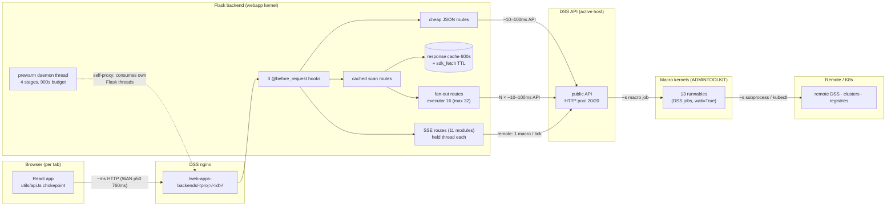

# Level 4 — Architecture & Boundary Crossings

**Question this level answers:** Which routes cross which process/network
boundaries how many times? Where are the N+1 shapes?

| | |
|---|---|
| Date | 2026-07-23 |
| Git HEAD | `f09db6a` |
| akaos toolkit version | 0.4.792 (`/api/mode`) |

Citations are `path:line (symbol)`; backend paths under
`python-lib/adk_backend/` unless noted. **Re-grep the symbol before trusting a
line number after any release.** Provenance: `[code]` unless labeled
`[live 2026-07-23 akaos]` (see L5 for the measurement protocol).

## 1. Boundary catalog

Scale: the Flask app serves **146 routes** (145 across 36 blueprints +
`/__ping`), registered in `webapps/admin-toolkit/backend.py:203-238`.

| Boundary | Mechanism | Cost class | Notes |
|---|---|---|---|
| in-process (Flask ↔ caches, /proc reads) | function call | ~ns–µs | response cache, sdk cache, local `/proc` sampling |
| browser ↔ DSS nginx ↔ Flask | HTTPS via `/web-apps-backends/<PROJECT>/<webappId>/api/…` | ~ms in-datacenter; WAN-dominated for remote admins — measured transport floor p50 760 ms, n=20, dev laptop → akaos `[live 2026-07-23 akaos]` (L5 §7) | every frontend call; DSS proxies to the webapp backend process |
| Flask ↔ DSS API (local or remote) | `dataikuapi` over HTTP, pooled `HTTPAdapter(pool_connections=20, pool_maxsize=20)` (`clients.py:116 (_local_thread_client)`, same pool for remotes `clients.py:265`) | ~10–100 ms band: in-datacenter `list_projects` ≈ 5 ms `[bench]`; WAN-remote host p50 ≈ 1.08 s, n=11 `[live]` (L5 §7) | the dominant crossing; every scan is N of these |
| Flask ↔ macro kernel | `_resolve_macro_project(g.client).get_macro(id).run(wait=True)` (`clients.py:371`, `macros.py`) | ~s per run | 13 macro IDs (`macros.py:9-21`); each run is a DSS job in the ADMINTOOLKIT project on the *active* host |
| macro ↔ remote host / K8s | subprocess / kubectl / fs reads inside the runnable | ~s | 17 dirs in `python-runnables/` (13 wired via `macros.py`) |
| prewarm self-proxy | backend → own DSS nginx → itself (`prewarm.py:103 (_self_candidates)`) | ~s–min; 900s per-request budget (`prewarm.py:42`) | consumes the same Flask threads it warms |

## 2. Cross-cutting middleware

Every `/api/*` request passes, in order:

1. `_attach_client` (`webapps/admin-toolkit/backend.py:59`) — reads
   `X-DSS-Host-Id`, seeds the host-key Fernet cache from the unlock cookie,
   resolves `g.client` via `_resolve_client` (`clients.py:292`) with a
   **per-thread per-host client cache** (`clients.py:306`).
2. `_check_red_unlock` (`backend.py:93`) — 403 for `@advanced` views without
   a valid unlock cookie.
3. `_check_host_ready` (`backend.py:106`) — short-circuits 409
   (remote-keys-locked) / 502 (host-unreachable) before any handler runs.

Shared machinery:

- **SSE**: `_sse_response` (`utils.py:89`) wraps every stream in
  `stream_with_context` + no-buffering headers; used by **11 route modules**
  (agents, code_envs, connections, container_execs, cru, hosts,
  image_cleaner, k8s_insights, llm_tools, overview, projects).
- **Response cache**: `_cache_get` (`caching.py:91`) — host-scoped keys
  (`caching.py:60 (_cache_key)`), in-flight coalescing (N callers → 1 loader
  + N−1 waiters), waiter budget `_CACHE_WAIT_TIMEOUT = 120.0`
  (`caching.py:50`) → 503 `cache_timeout` on expiry, session-epoch
  invalidation (`caching.py:32 (_bump_session_epoch)`).
- **SDK cache**: `_sdk_fetch` (`clients.py:73`) — TTL cache keyed
  `installid|host_id` (`clients.py:59 (_sdk_cache_instance_id)`), so host
  switches never serve cross-host data.
- **Thread-context propagation**: subclassed `ThreadPoolExecutor`
  (`clients.py:325`) copies the active host id (and bench recorder) into
  workers so `_thread_client()` (`clients.py:124`) targets the right host
  outside a request.

## 3. Request-path cost by route family

Not all 146 routes — the families that matter:

| Family | Examples | Boundary crossings | Concurrency shape |
|---|---|---|---|
| Cheap JSON | `/api/mode` (`routes/misc.py:69`), `/api/java-memory`, `/api/settings/raw` | 0–1 DSS API call | serial, sub-second |
| Cached scans | `/api/overview`, `/api/connections`, `/api/users`, `/api/plugins`, `/api/code-envs`, `/api/project-footprint`, `/api/llm-audit` | first hit: full fan-out; warm hit: 0 (response cache, TTL 600s; llm-audit 7200s) | `_cache_get` coalesces concurrent callers |
| Parallel fan-outs (cold path of cached scans) | footprint `parallel_workers_default`=16 (`routes/footprint.py:124`); code-envs `code_env_detail_workers`=16 (`routes/code_envs.py:315`); connections health/audit `min(8, n)` (`routes/connections.py:286`, `:589`); plugin usages 16 (`routes/plugins.py:312`); git-log 8 (`clients.py:558`); cs-template 8 (`routes/cs_template.py:106`); image-cleaner 3 (`routes/image_cleaner.py:640`); llm-tools dual 16+16 pools (`routes/llm_tools.py:370`) | N projects × 1–3 DSS API calls each | worker pool bounded by knob; all workers share the 20-conn HTTP pool |
| **Serial N+1** | config-inspect `notebooks` domain (`routes/admin_actions.py:261-273`): serial `list_jupyter_notebooks` per project, cap 100 projects / 200 rows; `notebook-kernels-shutdown` (`routes/admin_actions.py:701-720`): same serial loop, cap 100; remote backup-project discover (`clients.py:432-462`): serial `get_project` + `list_webapps` + `list_managed_folders` per project, mitigated by a 300s cache (`clients.py:464`) | N × 1–3 API calls, **sequential** | one Flask thread held for the whole walk |
| Macro-backed | db-health, image-cleaner ops, k8s-insights audit, cru-audit, adoption inventory/events, log-cleaner, docker-governor, k8s-apply, fs-cleanup, host/process/resource metrics | 1 macro run (= DSS job) each, `wait=True` | blocks the Flask thread for the job duration |
| Resource stream **local** | `/api/host/resource-stream` (`routes/overview.py:235`) | 0 — reads `/proc` in-process, 1s loop (`overview.py:253-276`), process table capped at 200 rows (`proc_stream.py:18 (_MAX_PROCESSES)`) | 1 held Flask thread per open viewer; no client, no macro |
| Resource stream **remote** | same route, non-local host | **1 resource-sample macro run per tick** (`overview.py:290`); `?period=` clamped to [1, 600]s, default 1 (`overview.py:229-232`); `ps` snapshot via a second macro every `_REMOTE_HEAVY_PERIOD_S = 60` (`overview.py:232`, `:296`) | 1 held thread + ~1/period macro jobs/s per viewer |

## 4. Boxes and arrows

## 5. Current findings at this level

1. **Two serial N+1 walks in `admin_actions.py`.** The `notebooks`
   config-inspect domain (`routes/admin_actions.py:261-273`) and
   `notebook-kernels-shutdown` (`routes/admin_actions.py:701-720`) both walk
   up to 100 projects sequentially, 1–2 DSS API calls per project, holding
   one Flask thread the whole time. Same fan-out treatment as footprint
   (executor + host-propagating pool) would collapse the wall-clock ~10×.
2. **`clients.py` serial discover** (`clients.py:432-462
   (_remote_backup_project_key)`): 3 API calls per project, serial, on a
   *remote* client (so per-call latency is the WAN band). The 300s cache
   (`clients.py:464`) makes it a once-per-5-min cliff rather than a constant
   cost — but the first backup-related call after each expiry eats the full
   walk.
3. **The connections/health double-stream (L3 finding 1) at this level =
   2 held Flask threads + 2 DSS-API polling fan-outs per tab** that has both
   the startup scan and a manual re-run in flight. Each stream is a
   `min(8, n)`-worker fan-out (`routes/connections.py:286`) — overlap doubles
   the connection-test load on the DSS backend and on slow JDBC targets.
4. **Prewarm competes for the pool it warms.** Self-requests ride the DSS
   nginx proxy back into this same Flask process (`prewarm.py:103`), so
   during warmup the backend serves its own heavy scans while first users
   arrive; coalescing (`caching.py:91`) means users *join* the warm loaders
   rather than re-running them, but they still queue behind them, up to the
   120s waiter budget.
5. **Remote resource streaming cost multiplies per viewer.** Each open
   Resources page on a remote host runs its own SSE loop at ~1 macro job per
   `period` (default 1s — `overview.py:229`) plus a `ps` macro every 60s.
   Two viewers = double macro-job load on the remote host; there is no
   server-side sample sharing between streams.
