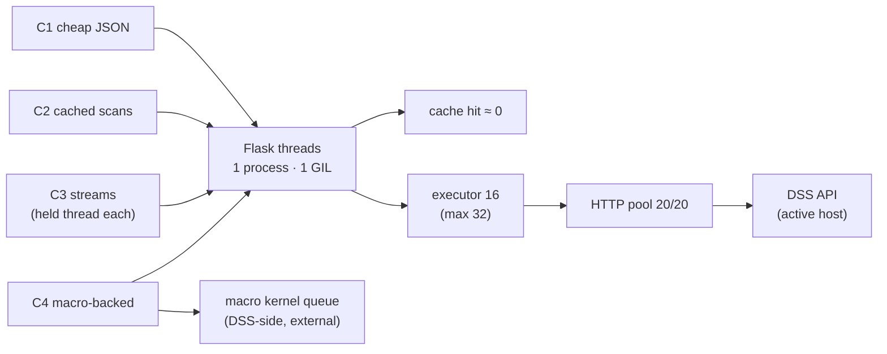

# Level 5 — Workload Model

**Question this level answers:** What saturates first at N hosts × M tabs?
Which knob moves which curve?

| | |
|---|---|
| Date | 2026-07-23 |
| Git HEAD | `f09db6a` |
| akaos toolkit version | 0.4.792 (`/api/mode`) |

**Re-grep cited symbols before trusting line numbers after any release.**

## 1. Provenance legend

- `[code]` — derived from source, cited `path:line (symbol)`.
- `[bench]` — harvested from `/api/debug/perf` (`routes/debug.py:94
  (api_debug_perf)`) on akaos: `last_*_benchmark` per-run instrumentation and
  historical phase-3 tuning results.
- `[live 2026-07-23 akaos]` — fresh read-only measurement, always with `n=`.
  Client location: dev laptop over WAN/TLS → akaos (AWS). WAN transport
  dominates absolute numbers; deltas between endpoints are the signal.
- Percentiles: n=20 → p50 = mean of ranks 10–11; "p95" = rank 19 (the
  second-largest). Rep 1 of repeated timings is always discarded
  (connection/TLS setup).
- Cold-cache numbers are **unobservable** on akaos (`prewarm_on_start=1`
  repopulates at backend start): first-rep anomalies are labeled
  "TTL state unknown", never "cold".

## 2. Request classes

| Class | Members | Arrival pattern | Server cost | Concurrency held |
|---|---|---|---|---|
| **C1** cheap JSON | `/api/mode`, `/api/java-memory`, `/api/settings/raw`, `/api/host/summary` | per page-load burst; `/api/mode` also polled by version store | 0–1 DSS API call; `/api/host/summary` ≈ 1.0 s server-side (subprocess set, uncached by design — `routes/overview.py:174`) | 1 thread, sub-second to ~2 s |
| **C2** cached scans | overview, connections, users, plugins, code-envs, footprint, llm-audit, plugin-usages | once per TTL window per host; startup ritual hits all of them | warm: ≈0 (response-cache hit); cold: full fan-out (see L4 §3) | warm: negligible; cold: 1 route thread + 8–16 executor workers |
| **C3** streams | 13 SSE consumers (L3 §4b): resource-stream, health, usages, cru, k8s, execs, chat, report, … | resource-stream continuous while page open; scan streams once/session; chat per turn | generator loop; local resource-stream reads `/proc` at 1 s | **1 held Flask thread each for the stream's whole lifetime** |
| **C4** macro-backed | remote resource ticks, db-health, image-cleaner, cru-audit, adoption ×2, k8s ops, cleaners | user-triggered, plus **1/tick per remote-stream viewer** | 1 DSS job on the active host, `wait=True` (~s each) | 1 held thread + 1 remote macro kernel slot per run |

## 3. Stream cadences

| Stream | Cadence | Source |
|---|---|---|
| resource-stream local | 1 s fixed loop | `[code]` `routes/overview.py:274`; `[live 2026-07-23 akaos]` inter-frame median 1.009 s, mean 1.008 s, n=11 gaps — no nginx burst-batching observed |
| resource-stream remote | `?period=` clamp [1, 600] s, default 1; UI picker offers {1, 2, 5, 15, 30, 60} | `[code]` `routes/overview.py:229-232` |
| remote `ps` snapshot | every `_REMOTE_HEAVY_PERIOD_S = 60` s (second macro) | `[code]` `routes/overview.py:232` |
| loader progress sidecars (llm-audit / footprint / code-envs) | 1 s poll while parent request in flight | `[code]` e.g. `hooks/apiLoader/secondary.ts:55` |
| frame sizes (local) | `sample` ≈ 348 B, `processes` ≈ 35 KB median | `[live 2026-07-23 akaos]` 12 s capture, 12 sample + 11 processes frames |

M7 (remote-stream tick timing) skipped by default — each tick costs a macro
kernel run; remote tick cost = 1 DSS job (`[code]` `routes/overview.py:290`).

## 4. Pools and capacities

| Capacity | Value | Provenance |
|---|---|---|
| Flask serving model | **1 process** (`dataiku.webapps.backend` under the plugin code env), threaded — 1 sibling worker, 7 threads at idle, 4 CPUs on akaos | `[live 2026-07-23 akaos]` `/api/debug/workers`; single-process ⇒ all classes share one GIL |
| Scan executor width | `parallel_workers_default = 16`, clamped by `parallel_workers_max = 32` (`utils.py:97 (_parallel_workers)`) | `[code]` `settings.py:13`; `[live]` M4 confirms 16/32 |
| Code-env detail fan-out | `code_env_detail_workers = 16` | `[code]` `settings.py:15`; `[live]` confirmed |
| Git-log fan-out | `min(8, n)` | `[code]` `clients.py:558` |
| Connections health/audit fan-out | `min(8, n)` | `[code]` `routes/connections.py:286`, `:589` |
| DSS HTTP connection pool | `HTTPAdapter(pool_connections=20, pool_maxsize=20)` per thread-cached client | `[code]` `clients.py:116` |
| Macro kernel concurrency | DSS-side (job queue on the active host), external to this app | `[code]` `macros.py` |

**Live knob values vs code defaults: zero drift on akaos** — every
`backend_settings` value in M4 equals the `_BACKEND_SETTINGS` default
(`settings.py:11`). (Contrast: tam historically stored a modified heavy
timeout — drift is possible and is itself a finding when present.)

## 5. Caches and TTLs

| Cache | TTL / budget | Live state `[live 2026-07-23 akaos]` |
|---|---|---|
| Response cache (`caching.py:91 (_cache_get)`) | 600 s default; llm-audit 7200 s; llm-pricing 21600 s | warm `/api/overview` hit ≈ transport-only (M3) |
| Coalescing waiter | 120 s (`caching.py:50`) then 503 `cache_timeout` | — |
| SDK fetch cache (`clients.py:73 (_sdk_fetch)`) | per-key TTL, keyed `installid\|host_id` | stats: 54 mem hits / 189 misses / 0 writes / 0 sql_ms |
| Remote backup-project discover | 300 s (`clients.py:464`) | — |
| Session epoch | invalidates response cache + frontend stores on reset (`caching.py:32`) | — |
| Prewarm (`prewarm.py:36 (_PREWARM_STAGES)`) | 4 stages, 900 s per-request budget | state `done`; stages: core 1.6 s, page-gating 0.7 s, audits 1.2 s, sizes-tail 4.4 s (≈8 s total on this small instance); base = external studio URL (the internal `127.0.0.1:10001` candidate 404s on the proxy path) |

Warm-vs-first delta (M3): `/api/overview` rep 1 = 1775 ms (TTL state
unknown), reps 2–5 p50 = 769 ms (n=4) — indistinguishable from the `/api/mode`
transport floor, i.e. **a response-cache hit costs ≈0 server-side**.

## 6. Knobs

Path: `plugin.json` `perf_*` params → `_PERF_MAP`
(`python-lib/db_adapter.py:111`) → `_BACKEND_SETTINGS`
(`python-lib/adk_backend/settings.py:11`), overridable at runtime via
`/api/settings` (Settings → Agents & Outreach / advanced).

| Knob | Bounds | Curve it moves |
|---|---|---|
| `parallel_workers_default` (16) | fan-out width for footprint / plugin-usages / llm-tools | cold-scan wall-clock ↔ DSS API pressure |
| `parallel_workers_max` (32) | hard clamp in `_parallel_workers` | ceiling for the above + env override |
| `code_env_detail_workers` (16) | code-env detail fan-out | code-envs cold-scan wall-clock |
| `cache_ttl_*` (600 / 7200 / 21600) | response-cache windows | how often C2 cold paths recur |
| `prewarm_on_start` (1) | startup warm | who pays the first cold scan (backend vs first user) |
| `codenvclean_thread_max` (20) | cleaner ops | tool-path parallelism |
| `fe_timeout_*` | served to the frontend for sync | when the UI gives up vs the backend |

## 7. Measured numbers

All `[live 2026-07-23 akaos]` unless labeled `[bench]`. WAN client; rep 1
discarded in every timed series.

| Metric | Value | n |
|---|---|---|
| Transport floor: GET `/api/mode` total | p50 760 ms · p95 829 ms · range 691–878 ms | 20 |
| GET `/api/host/summary` (uncached C1) | p50 1790 ms · p95 1850 ms → ≈1030 ms server-side over floor | 20 |
| GET `/api/overview` warm (reps 2–5) | p50 769 ms ≈ transport floor | 4 |
| GET `/api/overview` rep 1 | 1775 ms — TTL state unknown, not "cold" | 1 |
| DSS public API `/public/api/projects/` (shell→DSS, WAN) | p50 1081 ms · p95 1138 ms | 11 |
| Flask→DSS API in-datacenter, `list_projects` | 4.93 ms/call `[bench]` M4 code-envs benchmark | 1 |
| `compute_project_footprint` | avg 185.3 ms/call `[bench]` | 20 calls |
| Footprint scan, 20 projects | 1845 ms total `[bench]` | 1 run |
| Code-envs scan, 12 envs | 116 ms total `[bench]` | 1 run |
| Local resource-stream cadence | median 1.009 s between `sample` frames | 11 gaps |
| Stream frame size | `sample` ≈348 B; `processes` ≈35 KB | 12 s capture |
| TTFB vs total on timed GETs | TTFB ≈ total (delta <1 ms) — payloads are single-burst | 20 |

The M6 caveat: shell→DSS over WAN approximates the *transport* of Flask→DSS
only; the honest in-datacenter Flask→DSS figure is the `[bench]` 4.93 ms
`list_projects` row. The two bound the "~10–100 ms API" band used in L4 §1:
in-datacenter calls sit near the bottom (≈5 ms on idle akaos), WAN-remote
hosts near/above the top.

## 8. Saturation model

The walk, in order of what binds first:

1. **Held threads (C3).** Every SSE stream pins one thread in the single
   backend process for its lifetime. A tab during the startup ritual briefly
   holds up to ~3 (health + usages + a sidecar-adjacent heavy request); a tab
   parked on Resources holds 1 indefinitely. Threads are cheap
   (thread-per-request model, 7 at idle `[live]`), so the real cost is not
   thread exhaustion but GIL share: M viewers × 1 Hz × ~35 KB
   `json.dumps` per processes frame is pure Python CPU in one process.
2. **HTTP pool vs executor.** `pool_maxsize=20` with 16 workers fits; at the
   32-worker clamp, urllib3 doesn't queue — it opens **extra connections
   beyond the pool and discards them after use**, so >20 workers buys
   per-call TCP/TLS setup churn instead of reuse. Consistent with the
   phase-3 tuning result `[bench]`: **API throughput was flat from 8→32
   workers** — the bottleneck is DSS API latency/service time, not webapp
   parallelism. Raising `parallel_workers_*` moves no curve; lowering DSS
   API per-call latency (or call count — see L4 N+1s) does.
3. **Remote macro-per-tick (C4).** N remote-stream viewers at default
   `period=1` ≈ N DSS jobs/s on the remote host, plus N/60 `ps` macros —
   the only per-viewer cost that lands on *another* machine's job queue.
   The `?period=` clamp [1, 600] is the relief valve; the picker's 5–60 s
   options exist precisely for this.
4. **Coalescing budget.** When a cold heavy loader exceeds 120 s
   (`caching.py:50`), every waiter 503s (`cache_timeout`) — on large
   instances (tam-scale llm-audit ≈ 40–60 s `[code]` comment,
   `caching.py:47`) the margin is ~2×, not ∞.
5. **Prewarm self-competition.** At backend start, 4 prewarm stages replay
   the ritual through the same process (≈8 s on akaos `[live]`; minutes at
   tam scale). First users during that window join in-flight loaders
   (coalescing) rather than doubling the work, but they queue behind them.

## 9. Current findings at this level

1. **Worker knobs are maxed-out placebo.** Flat 8→32 `[bench]` throughput +
   the 20-conn pool + single-GIL process mean `parallel_workers_max=32` can
   only add connection churn. The leverage is fewer/faster DSS API calls
   (L4 findings 1–2), not wider fan-out.
2. **The response cache is doing its job.** Warm `/api/overview` is
   transport-only (§7); akaos knob drift is zero (§4); prewarm completes in
   seconds and leaves every C2 endpoint warm. On this instance, all
   user-perceived latency for warm pages is WAN transport.
3. **Held-thread arithmetic is benign until viewers × streams meets the
   GIL.** ~35 KB/s of JSON serialization per Resources viewer is the first
   real per-viewer CPU cost; 10 viewers ≈ 350 KB/s of `json.dumps` plus
   `/proc` parsing at 1 Hz in one process.
4. **Remote streaming is the only unbounded external cost:** default 1 s
   period × per-viewer streams = 1 macro job/s/viewer on the remote host's
   job queue (M7 deliberately not measured; `[code]`
   `routes/overview.py:290`). A server-side shared sampler per host (one
   loop, fan-out to viewers) would make this O(1) in viewers.
5. **`/api/host/summary` costs ≈1 s server-side per click** (§7) — uncached
   by design (`routes/overview.py:174`); fine as a manual refresh, would be
   a mistake to poll.
6. **sdk_cache writes=0 with 189 misses** (§5) suggests the misses were
   either L1-mem-served after first fill or short-TTL churn — worth a look
   if `sql_ms` ever climbs; today it's 0.0, so the cache layer is free.
