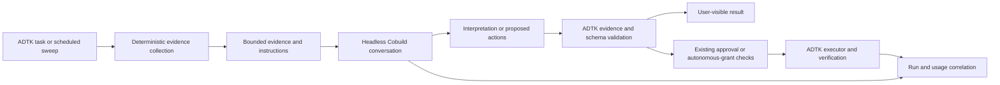

> Historical assessment. The implemented whole-task migration and current readiness limits are documented in [Headless runtime](headless-runtime.md). Earlier operation-bridge and native-coverage recommendations are not the current routing specification.

Implemented routing (2026-09-15): interactive chat, scheduled recommendation drafting and autonomous planning select Headless or Legacy at the task boundary. Headless uses the actual MCP conversation tools with no outer Mesh model and no per-operation Cobuild bridge. ADTK retains execution authority and approvals. Standalone AI features are unchanged. See the [fresh comparison inventory](reports/headless-validation-2026-09-15.md); its comparison adapter is separate from production routing, and Legacy remains the default while readiness limits are unresolved.

Follow-up testing on akaos is recorded separately in the [remaining-check report](reports/headless-remaining-validation-2026-09-16.md), measured on 0.4.868. The original inventory retains its 0.4.867 provenance.

# ADTK with Cobuild handling agent inference

Assessment: 14 September 2026. **Make Cobuild the target inference path for the in-scope agent features; retain ADTK as the operational application and tool backend.** Start with evidence-based scheduled recommendations. Full interactive and autonomous parity is conditional on a supported tool bridge, reliable background operation, and verified customer usage attribution.

This is an architecture assessment and proposed implementation sequence, not a completed migration. The customer objective is useful, attributable Cobuild consumption. Removing duplicate code is secondary. No claim of a percentage reduction in ADTK code or engineering effort is supported by the investigation.

[Interactive matrix](headless-capability-matrix.html) · [CSV](headless-capability-matrix.csv) · [Complete investigation and matrices](headless-integration-assessment.md) · [Live evidence](headless-integration-evidence.json)

## Exact scope

| Feature | Migration target |
| --- | --- |
| Interactive agent chat, including follow-up reasoning and action proposals | Cobuild |
| Scheduled triage recommendation drafts | Cobuild |
| Autonomous agent planning | Cobuild, with ADTK retaining execution policy |
| Standalone log AI analysis | **Excluded; unchanged** |
| Failed code-environment AI advice | **Excluded; unchanged** |
| Standalone AI report generation | **Excluded; unchanged** |

The exclusions concern standalone LLM features. Log-reading sensors, environment inventory and evidence used by the in-scope agents remain part of this assessment. Repository development skills are inventoried for portability but are outside the customer agent-inference target.

## What “using Headless” does and does not establish

Headless is an MCP tool/skill distribution. Most of its tools inspect DSS or call deterministic APIs. Its six Cobuild tools manage delegated conversations; it exposes neither a general replacement for an LLM completion API nor a general callback for arbitrary ADTK tools. An external LLM using Headless inspection tools remains a separate inference path. A DSS native/plugin agent executing through LLM Mesh is also a different path from Cobuild.

Dataiku documents Cobuild as a metered AI Service. Both Dataiku-operated and BYO-LLM modes are AI Services configurations. Designer included usage is per user; purchased AI Credits extend usage after the included allowance. Admin > AI Services shows user usage and remaining credits. These facts establish the relevant product mechanism, **not the amount or attribution of our test calls**. [AI Services setup](https://doc.dataiku.com/dss/latest/ai-assistants/setup.html), [AI Services usage](https://doc.dataiku.com/dss/latest/ai-assistants/usage.html).

Consequently, success needs two independent proofs: a useful verified ADTK task outcome and a usage record attributed to the intended customer identity. “The MCP request succeeded,” “an agent was created,” and “we used a Dataiku model” are insufficient. Consuming included usage and debiting purchased AI Credits should be reported separately. Do not deliberately exhaust included usage just to manufacture a purchased-credit demonstration.

The inspected Headless responses do not provide a verified per-turn debit field. ADTK token/cost estimates must not be relabeled as Cobuild credits. BYO-provider cost, if applicable, is another measurement and is not automatically equal to Dataiku metered usage. Actual entitlement, availability, and attribution need validation on each pilot instance; public latest documentation describes DSS 15, while the successful Cobuild provisioning test ran on DSS 14.7.3.

## What remains in ADTK

| Layer | What remains | What may move or be retired | Condition |
| --- | --- | --- | --- |
| Interactive product | Agent chat UI, history, host selection, evidence links, action checklists | In-scope model reasoning moves to Cobuild | Translate status/questions/outcomes into the existing UI lifecycle |
| Diagnostics | Health, storage, logs, Kubernetes, PostgreSQL, compute attribution and scan engines | Selected generic inventory calls may reuse Headless | No full replacement exists for the seven specialized diagnostic sensors |
| Health expertise | Deterministic scores, thresholds, critical rules and suppression behavior | Narrative interpretation and recommendations move | Cobuild must cite source evidence and preserve scores |
| Fleet management | Host registry, encrypted credentials, identity binding and managed-host macro routing | Some profile-discovery plumbing may be shared | Headless active-instance state cannot replace per-request host routing |
| Administrative actions | 53 planners/executors, canonical targets, gates, applicable backups, exact approvals and audit | A few low-level operations may call upstream primitives | Upstream operation and all current safeguards must pass parity checks |
| Scheduling | Scenario/macro entry point, sweep, thresholds, persistence and digest delivery | Recommendation drafting and LLM planning calls move | Background Cobuild must work without a browser and within a budget |
| Autonomous policy | Live grants, allowlist, kill switch, validators, execution budget and audit | Reasoned action proposals move | Cobuild cannot approve its own proposals or expand grants |
| State and reporting infrastructure | Snapshot/trend storage, scan caches, action history, exports and comparison contracts | Nothing demonstrated replaceable | Process-local conversation state is not durable application state |
| Domain instructions | Evidence/risk rubrics, capability manifests and admin task definitions | Adapt instructions for Cobuild tasks or upstream admin guides | Prompt text does not register tools or enforce authorization |
| Agent model configuration | Only controls still meaningful for the selected inference path | Agent-specific model selection/knobs may shrink | Preserve settings used by excluded LLM features; do not remove shared settings blindly |
| Agent loops | Adapters needed to feed evidence and handle outcomes | Native loop and plugin-agent reasoning loop may retire for migrated callers | Every in-scope caller must be moved; automatic LLM Mesh fallback must be disabled for this mode |
| Usage/value measurement | New ADTK run ledger and links to customer usage evidence | Nothing currently supplied as a complete integration | Identity, task outcome and observed meter movement must be correlated |

ADTK therefore remains a substantial admin product. Cobuild can own the reasoning while ADTK continues to measure, authorize, act, and explain the operational evidence. Moving inference does not make those deterministic capabilities redundant.

## Concrete call sites to migrate

| Path | Current role | Change in a Cobuild-only agent mode |
| --- | --- | --- |
| `python-lib/adk_backend/routes/agents.py` | DSS agent `as_llm()` relay for interactive chat | Route to the Cobuild adapter; preserve UI/session contract |
| `python-agents/admin-generalist/agent.py` and `python-lib/atk_agent_common/agent_runtime.py` | Plugin-agent reasoning through `DKUChatModel` | Stop invoking this model loop for migrated agent features |
| `python-lib/adk_backend/agent_native.py` and `python-lib/atk_agent_common/native_loop.py` | Native execution/fallback reasoning path | Disable automatic model fallback for Cobuild-only mode; retire unused loop code only after caller audit |
| `python-runnables/agent-triage-sweep/runnable.py` | Scheduled `get_llm().new_completion()` recommendation drafting | Submit bounded fleet evidence to Cobuild; keep deterministic sweep and persistence |
| `python-lib/atk_agent_common/triage/auto_agent.py` | LLM-planned remediation | Ask Cobuild for proposals; validate and execute through ADTK under existing grants |

The current default runtime is `dataiku`, with a native choice/fallback. That default means DSS-managed agent execution, not Cobuild. Changing a configuration label does not redirect inference.

Out-of-scope calls in `routes/llm_tools.py` and `routes/code_env_broken.py` remain on their current paths. The target metric is **100% of in-scope inference**, not 100% of every LLM call in the plugin.

## Architecture choices

| Option | Credit objective | Feasibility and tradeoff | Recommendation |
| --- | --- | --- | --- |
| Keep the current LLM agent and give it Headless tools | Does not establish Cobuild-only inference; outer agent still calls its model | Easy tool reuse, but fails the new routing objective | Not the target architecture |
| Current LLM agent delegates selected work to Cobuild | Mixed inference paths | Useful transitional experiment, not full migration | Label mixed usage explicitly if used |
| Deterministic ADTK gathers evidence; Cobuild returns interpretation/proposals | Candidate for all inference in bounded workflows to be Cobuild | Avoids requiring Cobuild to call arbitrary ADTK tools; synthesis and schema adherence need testing | **First pilot** |
| Cobuild orchestrates ADTK tools through a supported bridge | Best conceptual fit for open-ended chat and planning | No such exposed invocation bridge was found in the inspected version | Target architecture, blocked on interface support and validation |
| Native visual agent built by Cobuild, then executed through LLM Mesh | Creation uses Cobuild; runtime inference is a separate path | Provisioning was proven, execution and usage objective were not | Does not satisfy the runtime objective on current evidence |

Proposed initial flow:

This is a proposed integration, not a discovered built-in workflow. The adapter can use Headless MCP; a direct supported Cobuild SDK conversation is an alternative worth evaluating. The important usage boundary is the Cobuild service, not whether a local stdio wrapper is present. Reconfirm the SDK route's supported use and metering before choosing it.

The first version should avoid an outer LLM router, LLM-based JSON repair, LLM summarizer, or LLM fallback outside Cobuild. Use explicit workflow selection, deterministic evidence collection and schema validation. Follow-up reasoning, if needed, goes back to Cobuild. Arbitrary open-ended exploration cannot be claimed equivalent until a supported request/tool/result cycle exists.

## Highest-priority demonstration

1. Select a customer-scoped project and identity with working Cobuild access. Record the relevant usage view, identity, instance, project and time window before the run. A hub service account must not accidentally be presented as customer consumption.
2. Run ADTK's deterministic triage sweep. Build a compact evidence pack containing host, observation timestamp, score, issue IDs, supporting measurements, coverage gaps and permitted next steps. Omit credentials and unnecessary raw log data.
3. Ask Cobuild to rank and explain the supplied findings and draft recommendations. This is the first unproven task to validate; the earlier live test established empty-project inspection and object provisioning, not this specific evidence-synthesis workflow.
4. Validate citations, unchanged deterministic scores, known action IDs and grounded targets. Display recommendations with evidence links. The first demonstration need not execute a mutation.
5. Observe the corresponding AI Services usage after reporting has updated. Correlate with task timestamps and conversation IDs. If only aggregate usage is available, use a controlled window and disclose attribution limits rather than assigning invented per-run credits.
6. Present the customer outcome alongside the measurement: useful findings, accepted recommendations, successful task count, elapsed time, included usage consumed and any purchased-credit debit that was actually observed. Report a task whose result failed separately, even if it consumed usage.

Do not increase calls to drive consumption without value. A credible demonstration shows why the usage was worthwhile: an actionable incident explanation, a migration/scoping recommendation, or a verified improvement.

## Implementation order and exit criteria

Effort labels in the matrix are relative estimates: Small = bounded instruction/configuration adaptation; Medium = an adapter plus output/permission checks; Large = runtime or cross-host lifecycle work. They are not delivery-date estimates. Priorities reflect the Cobuild usage objective, not severity of an existing defect.

| Priority | Work | Exit criterion |
| --- | --- | --- |
| P0 | Bounded scheduled-recommendation pilot | Runs without a browser; facts grounded; intended identity verified; usage movement observed or precisely documented as unavailable |
| P0 | Identity and task ledger | Correlate host/project/user/conversation/outcome; distinguish included usage, AI Credits and provider cost |
| P0 | Error/progress adapter | Immediate progress, bounded waits, question handling, explicit failed/aborted/unknown outcomes; deterministic features survive credit exhaustion |
| P0 | Supported tool-bridge investigation | Demonstrate Cobuild requesting an ADTK read and consuming its result without an outer LLM or arbitrary code-execution workaround |
| P1 | Interactive agent migration | Multi-turn read/tool/result parity, evidence and action proposals, two-host isolation and reliable outcome handling |
| P1 | Autonomous planning migration | Validated proposals; grant/kill-switch/target checks; bounded retries; no unapproved or duplicate execution |
| P1 | Remove unused in-scope inference paths | Runtime tracing proves no in-scope calls reach the old LLM routes; excluded features continue to work |

A credit or entitlement failure should make agent reasoning visibly unavailable while leaving deterministic administration usable. Do not silently fall back to LLM Mesh in the strict Cobuild mode. If the product later offers an explicitly selected mixed mode, label its inference and usage paths separately.

## Known blockers and evidence limits

- **Tool invocation:** both the user-supplied Cobuild inspection and our test found no exposed invocation of registered ADTK plugin tools or macros. Listing their definitions is insufficient. Porting an external skill cannot fix this by itself.
- **Headless execution and cancellation:** simple tool/agent creation succeeded in TAMGLOBAL. A subsequent agent test stalled on a UI chat-control operation and required UI cancellation. The terminal response still said `completed` and `is_error=false`, with an aborted message. No exposed MCP cancel tool was found. Full background lifecycle parity is unproven.
- **Provider permissions:** an independent native-agent invocation returned Bedrock 403 for the test user. This is distinct from the stalled UI-control path. Model discovery does not prove invocation permission.
- **Credit accounting:** akaos was credit-blocked despite the requested license/credit/BYO changes. TAM Cobuild worked, but before/after credit deltas were not captured. We cannot claim those changes fixed accounting or quantify consumption.
- **Concurrency and restart:** per-call instance pinning protects started calls, but a shared switch-then-call sequence can interleave across users. Headless's conversation registry is process-local. Test isolation, reconnect/restart, timeout and uncertain mutation outcomes before replacing current behavior.
- **Product support:** generic custom-tool registration, native DSS Skill import, programmatic cancellation, durable resume and per-turn meter access are upstream questions. None is implied merely by the existence of an SDK or MCP server.

Recommended upstream requests are a supported custom-tool bridge, explicit host/identity binding, durable conversation resume/cancel, machine-readable operation outcomes, and usage correlation identifiers. Shareable ADTK contributions are the admin evidence/risk playbooks and controlled diagnostic/action interfaces. Repository release skills, React contracts, UI stores and Toolkit-specific audit/settings endpoints have little value as generic Headless skills.
