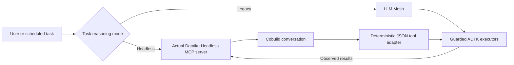

# Headless and Legacy reasoning

Two user-facing modes live in Agents → Permissions. **Legacy remains the
default** until Headless readiness is established. Selecting Headless is an
explicit opt-in; a failure never changes the mode automatically.



Headless owns tool selection and final answers for interactive chat, scheduled
triage recommendation drafting and autonomous planning. There is no outer Mesh
model and no per-operation Cobuild explanation layer. Both modes retain the
11 sensors and 53 administrative actions. Standalone log AI, failed-environment
advice and AI reports are unchanged.

## Boundary and authority

`atk_agent_common/reasoning.py` reads the mode once at each task boundary.
Historical `agent_capability_providers` values remain stored for migration
history but are ignored by live routing. The old `agent_runtime` native/kernel
setting only selects the hosting vehicle; it is no longer a user-facing mode.
Remote chats run the selected host's plugin agent. Failed kernel tasks never
replay through the native vehicle. A virtual local agent still uses the native
vehicle when no DSS agent has been provisioned.

Headless responses are strict JSON tool requests or final answers. The adapter
validates the whole request batch against available tool schemas before any
tool runs. ADTK remains responsible for canonical targets, fresh capability
permissions, signed confirmation tokens, advanced-action unlocks, backups,
kill switches and audit. In chat, only the current human approval-card message
can supply an execution token. Tokens minted by a plan are shown to the human
but removed from observations sent back to Cobuild. An attempted token cannot
execute twice within a task. The existing backend still verifies it.

Autonomous proposals retain their grant, host, exclusion, deduplication and
budget checks. Grants and pause/kill switches are reread before proposing and
again after planning. Fixture-controller approval shortcuts exist only in the
comparison scripts; production does not import them.

## Actual MCP transport and isolation

The backend hosts the pinned upstream Dataiku Headless FastMCP server using
FastMCP's in-process MCP client transport. This executes the actual MCP tool
handlers and protocol serialization; it does not rename direct SDK calls.
One event loop stays warm and each task keeps its own MCP connection and
Cobuild conversation. There is no managed-host subprocess to launch.

Only conversation start, send and retained-turn status are callable by the
adapter. Every send sets `allow_edit_project=False`; native confirmations and
questions terminate the adapter task instead of granting native permissions.
No native instance switch, write tool or confirmation-approval tool is exposed.

The upstream Cobuild module's two identity/client accessors are bound through
a ContextVar to the task's existing DSS client. Its worker executor propagates
that context. The upstream CLI's mutable active-instance setting is never
changed. Owner hashes include host, credential identity and a private random
identity unique to each ToolkitClient. Changing advanced-unlock cookies does
not change ownership. Native clients/tool bundles are fresh per task.

## Lifecycle, progress and limits

- At most eight live/unknown tasks per backend; idle connections expire after
  one hour, allowing long ADTK operations to return their observations.
- Each model turn waits at most 300 seconds. A Headless pending response is
  polled using the exact retained turn ID, never resubmitted.
- Chat emits waiting progress and heartbeat events during inference and ADTK tools.
  A tool wait is bounded to one hour; an expired wait does not retry the operation. Outcomes include completed,
  failed and unknown. Stopping local polling is **not verified remote cancellation**.
- Unknown tasks cannot accept another message. Backend restart loses local
  conversation state and reports the loss; it does not transparently start over.
- Private transcripts stay in bounded process memory and the authenticated chat
  response. The service does not log prompts, results, credentials or raw SDK
  exceptions. Native Headless chat does not copy transcripts to interaction logs.
  DSS may retain its own Cobuild conversation according to instance policy.
- Mode, transport, wall time, model-turn count and tool count are recorded.
  Cobuild model identity, credits and token usage are not inferred.

## Packaging and installation

The reviewed upstream pin is `9d7f6cc29a9406f347708c8811b5689ab257c6c8`
(Dataiku Headless 0.6.0). Its repository is private. `make plugin` fetches that
exact commit on the authorized build machine and packages only upstream Python
source into the plugin's `python-lib/dataiku_mcp/`, alongside LICENSE/NOTICE
and a SHA-256 provenance manifest. This is the import path DSS carries into
webapp and agent kernels; it does not assume access to a resource directory. No `.env`, profile, credential, Git metadata or developer
checkout enters the distribution. The private upstream source is not checked
into this public repository.

Install the release ZIP, update the plugin Python environment, and restart its
backend/agent kernels. Public requirements pin FastMCP 4.0.3, MCP 2.2.0,
python-dotenv 1.2.3 and dataiku-api-client 15.0.1. DSS needs working Cobuild access
to ADMINTOOLKIT. A raw Git plugin install lacks the bundled private server and
cannot use Headless unless that exact upstream package is separately installed.
Legacy remains usable without loading Headless.

## Validation and readiness

Automated tests exercise the real in-process MCP transport with controlled DSS
responses: concurrent host/user isolation, multi-turn conversation reuse,
pending-turn recovery, bounded timeout, lost conversation, private error
redaction, strict parsing, permission denial, human confirmation and no repeated
write. Separate tests prove no outer Mesh calls in Headless and no Headless or
Cobuild calls in Legacy.

The historical five-pair trial measured direct SDK 11.47s and Headless 11.88s
successful medians, about 22ms wrapper overhead and 0.43s warm startup. One
Headless send returned pending at 240 seconds. Its benchmark raised ValueError
without polling the retained turn. The SDK timing file contains 13 completions
(five conversation starts and eight sends), not the stalled send's completion.
That places the unfinished work inside the SDK/DSS call, not JSON adapter work.
It does **not** establish a root cause. The original process-local turn state is
gone; its eventual remote outcome cannot be recovered from this evidence.

A new live MCP smoke conversation completed in 3.73 seconds. This is basic
connectivity evidence, not a replacement for full capability or reliability
validation. The 64-check runner now supports fresh Legacy/Headless runs:

```sh
.venv/bin/python scripts/agents/headless_model_compare.py --output /tmp/headless-reads.json
.venv/bin/python scripts/agents/run_cobuild_model_suite.py --execute --reasoning headless --output /tmp/headless-suite
```

Reports distinguish passed, failed, blocked and excluded. Historical passes are
not imported. Plugin deployment stays excluded. Cloud/image/Python destructive
cases need fresh fixtures or authorization and remain explicitly blocked until
those prerequisites exist. Keep the deployed default on Legacy while these
readiness limits and the stalled remote call's root cause remain unresolved.
